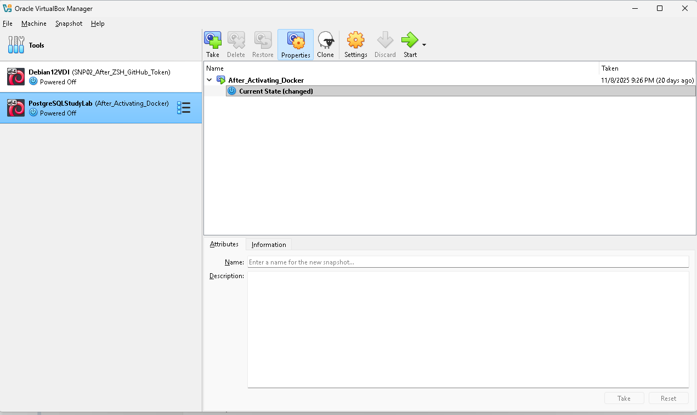
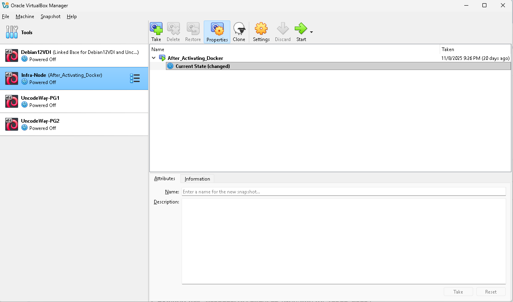
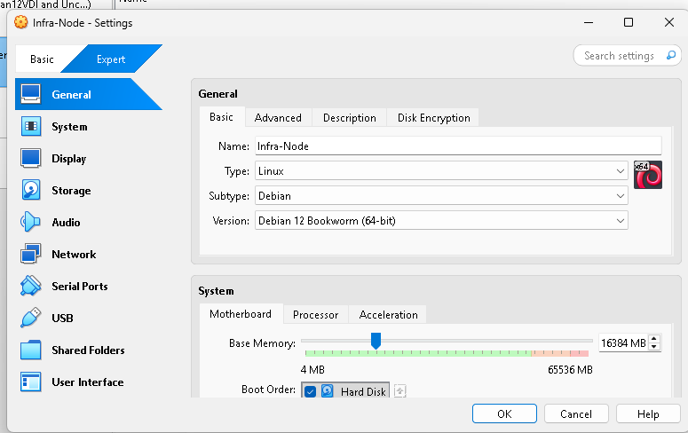
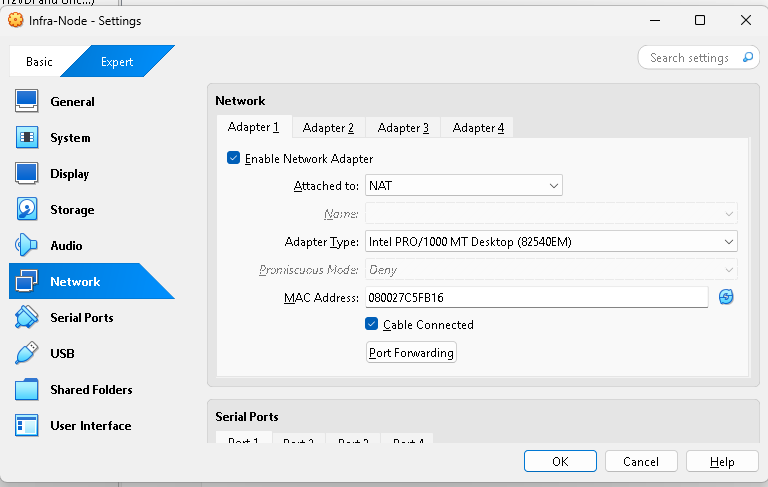

## Question01:
I want to more learning pgvector extension to PostgreSQL Database with POSTGIS & Apache AGE . I have Debian12VDI VirtualBox , I am going to clone it to use the clone as my Studying for PostgreSQL and its Extensions. Do you have any recommendations about this?

## Answer01:
This is a smart move. Cloning your VM gives you a "Sandbox" where you can break things without fear. Since you are combining **three distinct paradigms** (Relational/Spatial, Vector, and Graph) into one engine, the setup requires precision because **Apache AGE** is sensitive to PostgreSQL versions.

Here is your comprehensive **"Study Lab" Setup Guide** for Debian 12 (Bookworm).

### Phase 1: Pre-Clone Recommendations

Before you clone your VirtualBox VDI:
1.  **Network Settings:** Set your VirtualBox Network Adapter to **"Bridged Adapter"**. This allows your Windows/Mac host to talk directly to the Debian Postgres instance (e.g., via DBeaver or your C# code) using a real IP address like `192.168.1.X`.
2.  **Resources:** Ensure the clone has at least **4GB of RAM** and **2 vCPUs**. Vector indexing (HNSW) and Graph queries are memory-intensive.

---

### Phase 2: The "Golden Standard" Installation Sequence

**Crucial Warning:** Apache AGE usually lags slightly behind the very latest Postgres version. As of late 2024, **PostgreSQL 16** is the sweet spot where PostGIS, pgvector, and AGE all play nicely together. **Do not install PG 17 yet unless you verify AGE supports it.**

Open your terminal in the new Debian clone and run these steps:

#### 1. Install PostgreSQL 16 (The Official Way)
Debian 12 default repos might have older versions. Use the official Postgres repo.

```bash
# 1. Install prerequisites
sudo apt update && sudo apt install -y curl gnupg2 lsb-release

# 2. Add PostgreSQL official repository
sudo sh -c 'echo "deb https://apt.postgresql.org/pub/repos/apt $(lsb_release -cs)-pgdg main" > /etc/apt/sources.list.d/pgdg.list'

# 3. Add the signing key
curl -fsSL https://www.postgresql.org/media/keys/ACCC4CF8.asc | sudo gpg --dearmor -o /etc/apt/trusted.gpg.d/postgresql.gpg

# 4. Install Postgres 16 and Development headers (Needed to compile AGE)
sudo apt update
sudo apt install -y postgresql-16 postgresql-server-dev-16 build-essential git
```

#### 2. Install PostGIS and pgvector
These are now available directly via `apt` in the Postgres repo, which saves you from compiling them.

```bash
# Install PostGIS 3 and pgvector
sudo apt install -y postgresql-16-postgis-3 postgresql-16-pgvector
```

#### 3. Compile and Install Apache AGE
AGE is rarely in `apt`. You must build it from source.

```bash
# 1. Install build dependencies
sudo apt install -y flex bison

# 2. Clone the repo
cd ~
git clone https://github.com/apache/age.git
cd age

# 3. Check out the branch compatible with PG 16
# IMPORTANT: Check their GitHub releases. If PG16 isn't tagged, use PG15 branch or master.
# Assuming master supports 16 (check AGE documentation first):
git checkout master

# 4. Build and Install
sudo make PG_CONFIG=/usr/lib/postgresql/16/bin/pg_config install
```

---

### Phase 3: The Critical Configuration (The "Gotcha")

Apache AGE **will not work** unless it is loaded in the shared libraries configuration.

1.  Edit the config file:
    ```bash
    sudo nano /etc/postgresql/16/main/postgresql.conf
    ```
2.  Find `shared_preload_libraries` and change it to:
    ```conf
    # Order matters! PostGIS is usually implicitly loaded, but AGE needs this.
    shared_preload_libraries = 'age, vector'
    ```
3.  Restart PostgreSQL:
    ```bash
    sudo systemctl restart postgresql
    ```

---

### Phase 4: Creating Your "UncodeWay" Study Database

Now, log into Postgres (`sudo -u postgres psql`) and set up the environment.

```sql
-- 1. Create the Database
CREATE DATABASE uncodeway_lab;
\c uncodeway_lab

-- 2. Enable the Extensions (Order matters somewhat)
CREATE EXTENSION postgis;       -- For Maps/H3
CREATE EXTENSION vector;        -- For AI Embeddings
CREATE EXTENSION age;           -- For Knowledge Graph

-- 3. CRITICAL: Configure Search Path for AGE
-- If you don't do this, AGE queries will fail.
LOAD 'age';
SET search_path = ag_catalog, "$user", public;
```

---

### Phase 5: The "Trinity" Query (The Learning Goal)

To truly learn this, you should try to write a query that uses all three.
*   **Scenario:** Find a grave that is physically close (PostGIS), semantically similar to "Unknown Soldier" (pgvector), and connected to the "Al-Najafi" tribe (AGE).

Here is the table structure you should practice building:

```sql
-- 1. The Table (Relational + Spatial + Vector)
CREATE TABLE graves (
    id SERIAL PRIMARY KEY,
    location GEOMETRY(POINT, 4326),          -- PostGIS
    description_embedding VECTOR(384),       -- pgvector (from Python SentenceTransformers)
    grave_code TEXT                          -- Business Key for Graph
);

-- 2. The Graph (Apache AGE)
SELECT create_graph('cemetery_graph');

-- 3. The Query (The Holy Grail)
-- "Find graves within 50m of Entrance, semantically matching 'Martyr', linked to Tribe X"

SELECT
    g.id,
    st_astext(g.location),
    -- Vector Similarity Score
    (g.description_embedding <=> '[0.1, 0.2, ...]') as semantic_distance
FROM graves g
WHERE
    -- Spatial Filter
    ST_DWithin(g.location, ST_MakePoint(44.3, 31.9)::geography, 50)
    AND
    -- Graph Filter (Using Cypher inside SQL)
    g.grave_code IN (
        SELECT * FROM cypher('cemetery_graph', $$
            MATCH (t:Tribe {name: 'Al-Najafi'})<-[:BELONGS_TO]-(p:Person)-[:BURIED_IN]->(g:Grave)
            RETURN g.code
        $$) as (code text)
    )
ORDER BY semantic_distance ASC;
```

### Recommendation for Learning Tools

Since you are running this in a VM, do not code inside the VM terminal. It is painful.

1.  **DBeaver (Community Edition):** Install this on your Host Machine (Windows/Mac). Connect to the Debian IP. DBeaver has a great map viewer for PostGIS and supports standard SQL.
2.  **Jupyter Notebooks (VS Code):** Run Python notebooks on your host, connecting to the VM. This is the best way to experiment with `pgvector` embeddings.
3.  **Use `pgadmin4` (Docker Container):** If you prefer a web UI, you can run pgAdmin in a Docker container on the Debian VM and access it via browser from your host.

### Summary
1.  **Clone:** Yes, use a Bridged Adapter.
2.  **OS:** Debian 12 is perfect.
3.  **DB:** PostgreSQL 16 (Check AGE compatibility first, otherwise 15).
4.  **Config:** Don't forget `shared_preload_libraries = 'age'`.
5.  **Goal:** Master the "Hybrid Query" (SQL + Cypher + Vector) shown in Phase 5. That is where the magic of **UncodeWay** lives.

## Question02:
Can I run My AlarmInsight project on the Debian12VDI and work with the VirtualBox VM from Visual Studio + DBeaver using the VM IPv4 address?

## Answer02:
**Yes, absolutely.** This is a standard "Professional" Development setup. It mimics a production environment (Linux Server + Windows Client) much better than running everything on localhost.

However, default security settings in Linux and PostgreSQL will block you. You need to "punch holes" in the virtual walls to let Visual Studio and DBeaver talk to the VM.

Here is your **Step-by-Step Configuration Guide** to make this work seamlessly.

---

### Phase 1: VirtualBox Networking (The Foundation)
You must ensure the VM gets a real IP address from your home router, not a hidden internal one.

1.  **Stop** the VM.
2.  Right-click VM -> **Settings** -> **Network**.
3.  Change **Attached to** from "NAT" to **"Bridged Adapter"**.
4.  Select your actual PC's network card (WiFi or Ethernet).
5.  **Start** the VM.
6.  Inside Debian terminal, type: `ip addr`.
    *   Look for `inet 192.168.x.x`. **Write this down.** This is your **VM IPv4**.

---

### Phase 2: Open PostgreSQL to the World (For DBeaver)
By default, Postgres only listens to itself (`localhost`). You need to tell it to listen to your Windows PC.

**1. Edit `postgresql.conf`**
```bash
sudo nano /etc/postgresql/16/main/postgresql.conf
```
*   Find: `#listen_addresses = 'localhost'`
*   Change to: `listen_addresses = '*'` (Remove the `#`)
*   *Save and Exit (Ctrl+O, Enter, Ctrl+X).*

**2. Edit `pg_hba.conf` (Authentication)**
This file controls *who* is allowed to connect.
```bash
sudo nano /etc/postgresql/16/main/pg_hba.conf
```
*   Scroll to the bottom. Add this line to allow your specific subnet (or everyone):
    ```text
    # TYPE  DATABASE        USER            ADDRESS                 METHOD
    host    all             all             0.0.0.0/0               scram-sha-256
    ```
*   *Save and Exit.*

**3. Restart Postgres**
```bash
sudo systemctl restart postgresql
```

**4. Test with DBeaver (Windows)**
*   **Host:** Your VM IPv4 (e.g., `192.168.1.50`)
*   **Port:** 5432
*   **Database:** `uncodeway_lab`
*   **User/Pass:** (Whatever you set up, usually `postgres`)
*   *It should connect green.*

---

### Phase 3: Prepare Debian for .NET 8 (For AlarmInsight)
You need the .NET Runtime on the VM to run your app.

```bash
# 1. Add Microsoft Repo for Debian 12
wget https://packages.microsoft.com/config/debian/12/packages-microsoft-prod.deb -O packages-microsoft-prod.deb
sudo dpkg -i packages-microsoft-prod.deb
rm packages-microsoft-prod.deb

# 2. Install ASP.NET Core Runtime (You don't need the SDK if you just run the app)
sudo apt update
sudo apt install -y aspnetcore-runtime-8.0
```

---

### Phase 4: The Visual Studio Workflow
You have two ways to run `AlarmInsight` on the VM.

#### Option A: The "Production Simulation" (Publish & Copy)
This is best to test if it really works on Linux.

1.  **In VS 2022:** Right-click `AlarmInsight.API` -> **Publish**.
    *   **Target:** Folder.
    *   **Runtime Identifier:** `linux-x64`.
2.  **Copy:** Use a tool like **WinSCP** (Windows) to copy the `publish` folder to your Debian VM (e.g., `/home/youruser/alarminsight`).
3.  **Run (Debian):**
    ```bash
    cd ~/alarminsight
    # You must tell Kestrel to listen on all IPs, not just localhost
    ASPNETCORE_URLS="http://0.0.0.0:5000" ./AlarmInsight.API
    ```
4.  **Test:** Open Chrome on Windows and go to `http://192.168.1.XX:5000/swagger`.

#### Option B: The "Dev" Way (SSH Remote Debugging)
VS 2022 can debug directly inside Linux via SSH!

1.  **Debian:** Ensure SSH is running (`sudo apt install openssh-server`).
2.  **VS 2022:**
    *   Go to **Debug** -> **Attach to Process**.
    *   **Connection Type:** SSH.
    *   **Connection Target:** `youruser@192.168.1.XX`.
    *   (You first need to start the app on the VM manually, then attach).

---

### Phase 5: The Firewall (Don't forget this!)
Debian might block port 5000 (App) and 5432 (DB).

```bash
# If using UFW (Uncomplicated Firewall)
sudo ufw allow 22/tcp       # SSH
sudo ufw allow 5432/tcp     # Postgres
sudo ufw allow 5000/tcp     # AlarmInsight HTTP
sudo ufw enable
```

### Pro Tip: Connection Strings
In your `appsettings.json` (inside AlarmInsight), you currently probably have:
`"Host=localhost;..."`

When running the App **inside** the VM, `localhost` is correct (because the DB is also on the VM).
But if you run the App on **Windows** and want it to talk to the DB on the **VM**, change it to:
`"Host=192.168.1.XX;..."`

**Summary:**
1.  **Bridged Adapter** gets you the IP.
2.  **Postgres Config** lets DBeaver in.
3.  **ASPNETCORE_URLS** lets your browser reach the API.

## Question03:
I have 32GB RAM and 6CPU that I can use them for creating 8 VirtualBox for PostgreSQL (Using Vagrantfile).I have currently Debian12VDI VirtualBox VM, I can use it as Ansible Controller. and by Using the Vagrantfile , I wish to create the Other VMs for: HAProxy, Barman,LDAP (NginX),Hashicorp Vault,2 Node PostgreSQL (For Streaming Replication), FailOver. The Question is ; Do I need to create all VMs (Which will maybe drains the Resources Capacity) , or I can Build them all as Docker containers from within my Debian12VDI or as Podman?

## Answer03:
Based on your `systeminfo.txt`, I have some **very good news** and a **strategic warning**.

**The Good News:** You actually have **64GB of RAM** installed (`Total Physical Memory: 65,374 MB`), not 32GB. Your resources are excellent.
**The Warning:** Your CPU (Intel Core i7-10710U likely, based on "Model 166") has 6 Cores. While decent, creating **8 separate VMs** (kernels) will cause significant "Context Switching" overhead. Your laptop fans will scream, and the VMs might feel sluggish because they are fighting for CPU time, not RAM.

**The Answer:** **Do NOT create 8 separate VMs.** It is unnecessary overhead for what you are trying to learn.

Here is the **Hybrid Architecture** I recommend. It combines the "Realism" of VMs for your Databases (crucial for learning Replication/Failover) with the "Efficiency" of Docker/Podman for the support services.

### The Recommended Hybrid Topology (3 VMs Total)

We will use **Vagrant** to spin up 3 VMs. We will use **Docker/Podman** *inside* the first VM to handle the lightweight services.

#### VM 1: The "Infra-Node" (Debian 12)
*   **Role:** Ansible Controller, Load Balancer, Secrets, Backups, Directory.
*   **Specs:** 4 vCPU, 8GB RAM.
*   **Software (Native):** Ansible, Barman (better native for streaming backups).
*   **Software (Docker/Podman Containers):**
    *   **HAProxy:** (Port 5000 -> Routes to DB1/DB2).
    *   **Hashicorp Vault:** (Secrets management).
    *   **OpenLDAP + Nginx:** (Identity & Web Proxy).
*   **Why?** These services don't need their own Kernel. They run perfectly as containers.

#### VM 2: "PG-Primary" (Debian 12)
*   **Role:** PostgreSQL Primary Node.
*   **Specs:** 2 vCPU, 8GB RAM.
*   **Software:** PostgreSQL 16, PostGIS, Apache AGE, pgvector, Patroni (High Availability).
*   **Why VM?** Since you are compiling custom extensions (AGE) and learning deep internals, a native VM is easier to debug than a container. Also, simulating network failure for "Failover" is more realistic with a distinct VM IP.

#### VM 3: "PG-Replica" (Debian 12)
*   **Role:** PostgreSQL Standby Node.
*   **Specs:** 2 vCPU, 8GB RAM.
*   **Software:** Same as VM 2.

---

### How to Implement This (The Vagrantfile)

Create a folder on your Windows machine, create a file named `Vagrantfile` (no extension), and paste this. This sets up the 3-node topology automatically.

```ruby
# Vagrantfile
Vagrant.configure("2") do |config|

  # Global Config: Use Debian 12
  config.vm.box = "debian/bookworm64"

  # 1. The Infrastructure Node (Ansible + Docker Containers)
  config.vm.define "infra" do |infra|
    infra.vm.hostname = "infra.uncodeway.local"
    infra.vm.network "private_network", ip: "192.168.56.10"

    infra.vm.provider "virtualbox" do |vb|
      vb.memory = "8192"
      vb.cpus = 4
      vb.name = "UncodeWay-Infra"
    end

    # Install Ansible and Docker automatically on boot
    infra.vm.provision "shell", inline: <<-SHELL
      apt-get update
      apt-get install -y ansible docker.io docker-compose git
      usermod -aG docker vagrant
    SHELL
  end

  # 2. PostgreSQL Primary
  config.vm.define "pg1" do |pg1|
    pg1.vm.hostname = "pg1.uncodeway.local"
    pg1.vm.network "private_network", ip: "192.168.56.20"

    pg1.vm.provider "virtualbox" do |vb|
      vb.memory = "8192"
      vb.cpus = 2
      vb.name = "UncodeWay-PG1"
    end
  end

  # 3. PostgreSQL Replica
  config.vm.define "pg2" do |pg2|
    pg2.vm.hostname = "pg2.uncodeway.local"
    pg2.vm.network "private_network", ip: "192.168.56.21"

    pg2.vm.provider "virtualbox" do |vb|
      vb.memory = "8192"
      vb.cpus = 2
      vb.name = "UncodeWay-PG2"
    end
  end

end
```

### The Workflow: From Windows to "UncodeWay"

1.  **Start the Environment:**
    Open PowerShell in that folder and run:
    ```powershell
    vagrant up
    ```
    *This creates the 3 VMs connected on a private network (`192.168.56.x`).*

2.  **SSH into the Controller:**
    ```powershell
    vagrant ssh infra
    ```

3.  **Deploy Support Services (Docker on Infra):**
    Inside the `infra` VM, create a `docker-compose.yml`:
    ```yaml
    version: '3.8'
    services:
      vault:
        image: vault:latest
        ports: ["8200:8200"]
        environment:
          VAULT_DEV_ROOT_TOKEN_ID: "root"

      ldap:
        image: osixia/openldap:latest
        ports: ["389:389"]

      haproxy:
        image: haproxy:latest
        ports: ["5000:5000"]
        volumes:
          - ./haproxy.cfg:/usr/local/etc/haproxy/haproxy.cfg
    ```
    Run `docker-compose up -d`. Now your infrastructure is alive.

4.  **Run Ansible:**
    From the `infra` VM, you can now ping the other two database VMs:
    ```bash
    ping 192.168.56.20  # pg1
    ping 192.168.56.21  # pg2
    ```
    You can now write your Ansible playbooks on `infra` to install PostgreSQL, build Apache AGE, and set up Replication on `pg1` and `pg2`.

### Why this is better for *UncodeWay*:

1.  **Resources:** You use only 3 kernels instead of 8. Your 6-core CPU will handle this much better.
2.  **Barman:** You can install Barman natively on the `infra` VM. It can SSH into `pg1` and `pg2` to pull backups over the fast internal network.
3.  **Failover Testing:** If you want to test failover, you can simply "pause" `pg1` in VirtualBox. HAProxy (running in Docker on `infra`) will detect the timeout and switch traffic to `pg2`. This simulates a real-world outage perfectly.
4.  **Extensions:** Because `pg1` and `pg2` are real VMs, you can compile **Apache AGE** and **pgvector** easily without dealing with multi-stage Docker builds or ephemeral container file systems.

**Recommendation:** Delete your existing standalone "Debian12VDI" or repurpose it. Start fresh with this Vagrantfile to ensure the networking between the 3 nodes is configured automatically and correctly.

## Question04:
I already have these two VMs , How many VMs I still Need to Create for My PostgreSQLStudyLab?:



## Answer04:
Based on your screenshot and your goal to build the **Full HA/Failover Architecture** (Streaming Replication, Barman, HAProxy, etc.), here is the direct answer:

You need to create **2 more VMs**.

Here is how you should assign the roles to your current and new VMs to create the perfect 3-Node Cluster:

### 1. Existing VM: `PostgreSQLStudyLab` (Rename to: `Infra-Node`)
**Role:** The Controller & Support Services.
**Why:** Your screenshot shows this VM already has the snapshot **"After_Activating_Docker"**. This is perfect!
*   **Do not install Postgres here.**
*   Use this VM to run **Ansible** (to control the others).
*   Use the existing Docker inside it to run **HAProxy**, **Hashicorp Vault**, **LDAP**, and **pgAdmin**.
*   Install **Barman** (Backup Server) directly here.

### 2. New VM: Create `UncodeWay-PG1` (The Primary)
**Action:** Right-click your `Debian12VDI` (Base Image) -> **Clone**.
*   **Name:** `UncodeWay-PG1`
*   **MAC Address Policy:** Generate new MAC addresses (Important for networking!).
*   **Clone Type:** **Linked Clone** is fine (saves disk space and is faster) since this is a lab.
*   **Role:** This will be your **Master Database**. You will install PostgreSQL 16, PostGIS, AGE, and pgvector here.

### 3. New VM: Create `UncodeWay-PG2` (The Standby)
**Action:** Right-click your `Debian12VDI` (Base Image) -> **Clone**.
*   **Name:** `UncodeWay-PG2`
*   **MAC Address Policy:** Generate new MAC addresses.
*   **Role:** This will be your **Replica Database**. It will stream data from PG1. You will use this to test "Pulling the plug" on PG1 to see if HAProxy automatically switches your C# app to this node.

---

### Summary of your Lab Topology

| VM Name | IP (Example) | Role | Software |
| :--- | :--- | :--- | :--- |
| **PostgreSQLStudyLab** | `192.168.1.100` | **Infra & Backup** | Docker (HAProxy, Vault), Ansible, Barman |
| **UncodeWay-PG1** | `192.168.1.101` | **Primary DB** | Postgres 16 + Extensions (AGE, Vector) |
| **UncodeWay-PG2** | `192.168.1.102` | **Standby DB** | Postgres 16 + Extensions (AGE, Vector) |

### Important Network Setting
For these 3 VMs to talk to each other (for Replication and HAProxy routing), make sure all 3 are set to **Bridged Adapter** (so they are on your main LAN) **OR** create a specific **"NAT Network"** in VirtualBox preferences and assign all 3 to it.

**Bridged Adapter** is easiest because you can connect to all 3 from your Windows Host (Visual Studio/DBeaver) using their IP addresses.

## Question05:
Now I have these 3 VMS, can you check their Configurations?: (All the Same)



## Answer05:
This setup looks **90% correct**, but there are **two critical configuration risks** (Resources and Network) that could freeze your laptop or break the cluster communication.

Here is my technical review of your screenshots and recommendations to fix them before you power them on.

### 1. Resource Allocation Audit (CRITICAL)
**The Problem:**
You have assigned **16 GB RAM** and **4 CPUs** to *each* VM.
*   **Total Usage:** 3 VMs × 16GB = **48 GB RAM** (plus overhead).
*   **Total Usage:** 3 VMs × 4 CPUs = **12 vCPUs**.

Your Host Laptop (MSI Prestige 15) has **64GB RAM** and **6 Physical Cores (12 Threads)**.
*   **Memory:** You are leaving only ~16GB for Windows, Visual Studio, DBeaver, and Chrome. This is tight but acceptable.
*   **CPU:** You are assigning **100% of your CPU threads** to the VMs. This will cause **"CPU Contention"**. Your Windows mouse will stutter, and the VMs will actually run *slower* because they are fighting for processor time.

**The Fix:**
Please lower the specs. You do not need "Production" specs for a "Study Lab".
*   **Infra-Node:** Lower to **2 CPUs** and **4096 MB (4GB)** RAM. (It only runs lightweight containers).
*   **UncodeWay-PG1:** Lower to **2 CPUs** and **8192 MB (8GB)** RAM.
*   **UncodeWay-PG2:** Lower to **2 CPUs** and **8192 MB (8GB)** RAM.

*Result:* Total 20GB RAM and 6 vCPUs. Your laptop will run smooth as silk.

---

### 2. Network Adapter Audit (Bridged over Wi-Fi)
**The Problem:**
In Screenshot #4, you are using **Bridged Adapter** connected to **Intel(R) Wi-Fi 6 AX200**.
*   **The Risk:** Bridged networking over **Wi-Fi** is technically difficult for VirtualBox. Sometimes, the router refuses to give IP addresses to VMs because it sees multiple MAC addresses coming from one Wi-Fi chip.

**The Fix (If you get no Internet/Connection):**
If you boot the VMs and they don't get an IP (run `ip addr` inside Debian and see no 192.168.x.x):
1.  Go to **Adapter 2** settings.
2.  Expand **Advanced**.
3.  Change **Promiscuous Mode** from "Deny" to **"Allow All"**.
4.  If that still fails, you will need to switch Adapter 2 to **"Host-Only Adapter"** (but let's hope Bridged works first, as it's easier).

---

### 3. The "Cloning" Trap (MAC Addresses)
**The Problem:**
You mentioned the configurations are "(All the Same)".
If you cloned `Infra-Node` to create `PG1` and `PG2` **without** ticking the box "Generate new MAC addresses," all 3 VMs will have the exact same hardware address (e.g., `0800274D1901` seen in your screenshot).

**The Risk:**
Your router will panic. It will think there is an IP conflict. The VMs will knock each other offline constantly.

**The Check:**
1.  Go to Settings for **UncodeWay-PG1** -> Network -> Adapter 2 -> Advanced.
2.  Look at the **MAC Address**.
3.  Go to Settings for **UncodeWay-PG2** -> Network -> Adapter 2 -> Advanced.
4.  Look at the **MAC Address**.
5.  **Are they different?**
    *   **Yes:** Perfect. You are ready.
    *   **No:** Click the small **Refresh Icon** (Blue arrows) next to the text box to generate a new random one. Do this for both PG1 and PG2.

### Summary of Action Plan
1.  **Reduce CPUs** to 2 per VM.
2.  **Reduce RAM** (4GB for Infra, 8GB for DBs).
3.  **Verify MAC Addresses** are unique.
4.  **Start them up!** 🚀
