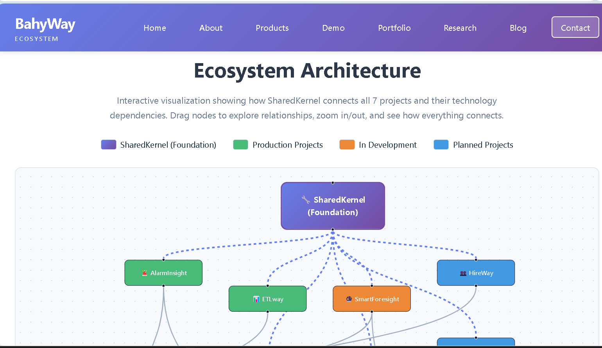
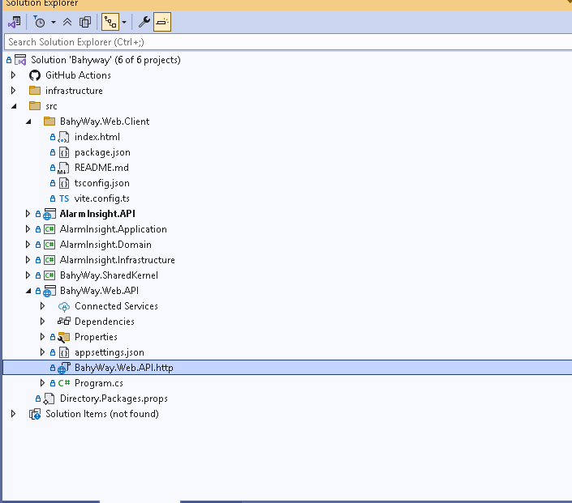
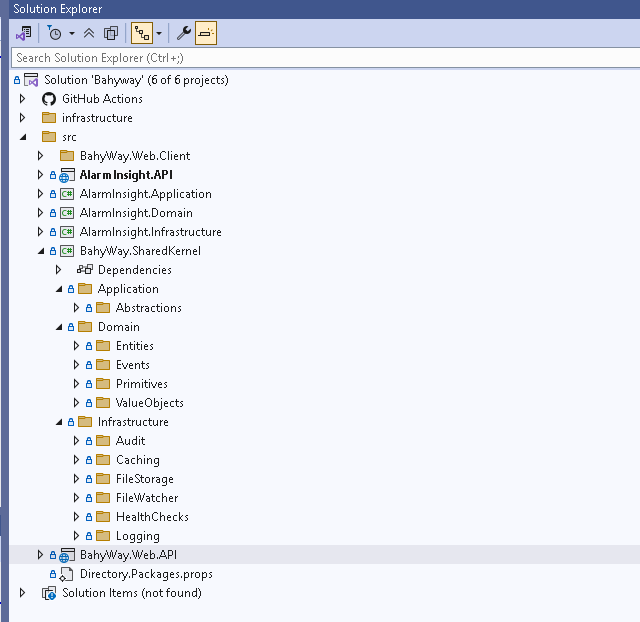

## Question01:

I have question about My Ecosystem I am building , Based on C# &.Net , am building an Cross-Platform Ecosystem of Multiple Projects that will share same Libraries (Like the one called ; Bahyway.SharedKernal), the question is: When I will finish these projects and converting them to products, Is that mean that each product will have its own version of the SharedKernal as Library?

## Answer01:
The short answer is **yes**.

From a **physical deployment standpoint**, every time you publish one of your products (like `AlarmInsight` or `ETLway`), the build process will take a copy of the compiled `Bahyway.SharedKernel.dll` and place it in the output folder of that specific product.

 However, the **strategic answer** depends on how you decide to manage the *lifecycle* of your ecosystem.

Here is the breakdown of the two ways this usually works in a .NET Ecosystem:

### 1. The Physical Reality (Deployment)
Regardless of how you manage your code, when you deliver the software to a client or host it on a server:

*   **AlarmInsight** will have its own folder containing `AlarmInsight.exe` and `Bahyway.SharedKernel.dll`.
*   **HireWay** will have its own folder containing `HireWay.exe` and `Bahyway.SharedKernel.dll`.

They do not share the DLL file on the hard drive (unless you are doing very old-school GAC registration, which is not recommended in modern .NET). This is good because it means **updating one product will not accidentally break the other.**

### 2. The Logical Reality (Versioning Strategy)
This is the most important decision you need to make for your ecosystem. You have two options:

#### Option A: The "Monorepo" Approach (Lock-step Versioning)
*   **How it works:** All your projects live in one giant Visual Studio Solution. You reference `SharedKernel` using a **Project Reference**.
*   **The Result:** Whenever you compile, *every* product gets the exact same version of the SharedKernel.
*   **Pros:** Very easy to debug. If you change a function in the Kernel, you see the impact on all products immediately.
*   **Cons:** Tightly coupled. If `SmartForesight` needs a breaking change in the Kernel, you *must* update and fix `AlarmInsight` immediately, or `AlarmInsight` won't compile.

#### Option B: The "NuGet" Approach (Decoupled Versioning)
*   **How it works:** You treat `Bahyway.SharedKernel` like a 3rd party library (like Newtonsoft or EntityFramework). You compile it and pack it into a **NuGet Package** (hosted on a private feed or local folder). Your products reference the *Package*, not the *Project*.
*   **The Result:**
    *   `AlarmInsight` might run on **SharedKernel v1.0.0**.
    *   `SmartForesight` might require new features and run on **SharedKernel v1.2.0**.
*   **Pros:** This is true "Ecosystem" behavior. You can update one product without being forced to redeploy the others.
*   **Cons:** slightly more complex workflow (you have to pack and publish the Kernel before you can use the updates in the products).

### Summary & Recommendation
Since you are building a **SharedKernel**, you are likely planning for these products to have different lifecycles.

**Yes, each product gets its own copy.**

*   If you use **Single File Publishing** (a feature in .NET Core/.NET 5+), the `SharedKernel.dll` will actually be merged inside the main `.exe` file.
*   If you use standard publishing, the `.dll` sits next to the `.exe`.

**My Advice:** Start with **Option A (Project References)** while you are building the foundation. Once the products go into production, switch to **Option B (NuGet Packages)** so you don't accidentally break a stable product while developing a new feature for a different one.

## Question02:
My Ecosystem sit in Visual Studio 2022, like this: see the screenshot, So, When I will publish my website, this does not mean that I need to couple with it the BahyWay.SharedKernal version, right?

## Answer02:
Based on your screenshot, the answer depends on **which part** of the "website" you are publishing, because you have two very different types of projects in that Solution Explorer.

Here is the breakdown based on your specific folder structure:

### 1. If you are publishing `BahyWay.Web.Client` (The Frontend)
**Answer: NO, it is NOT coupled.**

*   I see `vite.config.ts`, `package.json`, and `index.html`. This indicates a JavaScript/TypeScript frontend (likely React, Vue, or Angular).
*   When you build/publish this, it turns into HTML, CSS, and JavaScript files.
*   **Result:** The C# `SharedKernel.dll` will **not** be included in this deployment. The browser cannot read C# DLLs. This project is completely decoupled from the Kernel binary.

---

### 2. If you are publishing `BahyWay.Web.API` or `AlarmInsight.API` (The Backends)
**Answer: YES, it IS coupled.**

Looking at your Solution Explorer, it appears you are using **Project References** (referencing the `SharedKernel` project directly within the same Solution).

*   **The Deployment Reality:** When you click "Publish" on `BahyWay.Web.API`, Visual Studio will:
    1.  Compile `BahyWay.Web.API`.
    2.  Realize it depends on `BahyWay.SharedKernel`.
    3.  Compile `BahyWay.SharedKernel`.
    4.  Copy **both** the API `.exe` and the SharedKernel `.dll` to the publish folder.
*   **Why?** The API code calls functions inside the Kernel. If you upload the API without the Kernel DLL, the application will crash immediately with a `FileNotFoundException`.

### The Critical "Monorepo" Warning
Since you have everything in one Visual Studio Solution (as seen in the image), you are currently using a **"Lock-Step" model**.

If you change code in `BahyWay.SharedKernel` to support `AlarmInsight`, that change **automatically applies** to `BahyWay.Web.API` the next time you build it.

*   **You cannot** have `AlarmInsight` using "Version 1" of the kernel and `Web.API` using "Version 2" inside this specific Visual Studio setup easily.
*   They will always use the **exact same version** (the current code on your disk).

**Summary:**
*   **Frontend (Client):** Totally independent.
*   **Backend (APIs):** Physically requires the `SharedKernel.dll` file to run.
*   **Versioning:** Because they are in the same Solution, all your backend projects are forced to use the exact same version of the SharedKernel at all times.

## Question03:
I want all projects to be using an Reused Code Library, If this ( What I did so far is not good in long term) , Then what Design Pattern will help me achieve the Reusable Libraries I am making?

## Answer3:
What you are doing right now (having everything in one Solution with Project References) is called a **Monorepo with Source Dependencies**.

Is it "bad"? Not necessarily. It is excellent for speed in the beginning.
**But is it scalable for an Ecosystem? No.**

If you continue this way, you will hit the **"Lock-Step" Trap**: You will never be able to update `AlarmInsight` without potentially breaking `HireWay`. You will be forced to upgrade all your products simultaneously every time you change one line of code in the Kernel.

To solve this, you don't need a code "Design Pattern" (like Factory or Singleton); you need an **Architectural Strategy**.

The industry standard for what you are trying to build is **Package-Based Architecture (Internal NuGet)**.

Here is the roadmap to transition your Ecosystem from "Linked Projects" to "Reusable Libraries."

---

### The Strategy: Treat Your Kernel as a Product
Stop thinking of `BahyWay.SharedKernel` as just "code files." Think of it as a **3rd Party Product** that you sell to yourself. Just like you download `Newtonsoft.Json` or `EntityFramework`, your apps should download `BahyWay.SharedKernel`.

### Step 1: The "Internal NuGet" Pattern
This is the mechanical solution. Instead of your API referencing the *Project* on your hard drive, it should reference a *Versioned Package*.

1.  **Remove Project References:** In `AlarmInsight`, you delete the reference to the `SharedKernel` project.
2.  **Pack the Kernel:** You compile `SharedKernel` and turn it into a `.nupkg` file (NuGet Package).
3.  **Versioning:** You give it a number (e.g., `1.0.0`).
4.  **Host It:** You push this package to a private server (Azure Artifacts, GitHub Packages, or even a simple shared folder on your PC).
5.  **Consume It:** In `AlarmInsight`, you use the NuGet Package Manager to install `BahyWay.SharedKernel` version `1.0.0`.

**The Benefit:**
*   `AlarmInsight` is happy on **v1.0.0**.
*   You update the Kernel to **v2.0.0** with breaking changes for `HireWay`.
*   `AlarmInsight` **does not break** because it is still locked to **v1.0.0** until you decide to upgrade it.

---

### Step 2: The Code Design Pattern (Inside the Kernel)
Now, how do you write the code *inside* the Kernel so it is actually reusable? You should use the **Domain-Driven Design (DDD) Shared Kernel** pattern.

Your Kernel should **NOT** contain business logic specific to one app. It should only contain "Building Blocks."

#### What goes into the Kernel? (The "Yes" List)
1.  **Cross-Cutting Concerns:**
    *   Extension methods (e.g., `StringExtensions`, `DateExtensions`).
    *   Abstract Logging wrappers (e.g., `ILoggerAdapter`).
    *   Generic Repository Interfaces (e.g., `IRepository<T>`).
2.  **DDD Base Classes:**
    *   `BaseEntity`, `ValueObject`, `AggregateRoot`.
    *   `DomainEvent` base classes.
3.  **Standardized Results:**
    *   A generic `Result<T>` or `Error` class so all your APIs return responses in the same format.

#### What stays OUT? (The "No" List)
*   Do not put `Alarm` logic in the kernel.
*   Do not put `Employee` logic in the kernel.
*   If `AlarmInsight` needs a specific database tweak, do not put it in the Kernel.

---

### Step 3: The "Stable Dependencies" Principle
This is a design rule from Robert C. Martin (Uncle Bob).

> **"Depend in the direction of stability."**

Your `SharedKernel` must be more stable than the apps that use it.
*   **Volatile:** `AlarmInsight` (Changes every week based on client requests).
*   **Stable:** `SharedKernel` (Should change rarely).

**If you find yourself changing the Kernel every single day, you have a design problem.** You are likely leaking business logic into the Kernel.

### Summary: Your Evolution Plan

**Phase 1 (Where you are now):**
*   **Setup:** Single Solution, Project References.
*   **Pros:** Fast dev.
*   **Risk:** High coupling.
*   **Advice:** Keep this for now until you release your first **two** products.

**Phase 2 (The Hybrid):**
*   **Setup:** Keep the code in one repo, but configure the build pipeline to generate NuGet packages.
*   **Action:** When `AlarmInsight` builds, it references the NuGet package, not the project file.

**Phase 3 (The Ultimate Goal):**
*   **Setup:** Split the repositories.
    *   Repo 1: `BahyWay.SharedKernel` (Produces NuGet packages).
    *   Repo 2: `BahyWay.Ecosystem` (Contains your apps, consuming those packages).

**Recommendation:**
Since you are currently in Visual Studio with folder structures set up for DDD (I see `Domain`, `Application`, `Infrastructure`), you are on the right track!

**Don't over-engineer it yet.** Stick to your current setup, BUT follow this one rule: **"If I change this line in the Kernel, will it break an app I am not currently working on?"** If the answer is yes, you are ready to move to NuGet packages.


## Question04:
I am using DDD Paradigm in my Bahyway.SharedKernal:See the screenshot. But your suggestion of change it to a Nuget Packages is wonderful, Can you show me in Code how can I do that?

## Answer04:
This is a great move. Converting to NuGet packages forces you to respect boundaries between your subsystems.

Since you are likely working locally for now, we will set up a **Local NuGet Feed**. This allows you to simulate the full "Professional" workflow without needing to pay for a server (like Azure Artifacts) yet.

Here is the step-by-step "Infrastructure as Code" guide to make this happen.

### Phase 1: The Producer (Configuring the Kernel)

You need to tell MSBuild (the compiler) to create a `.nupkg` file every time you build the SharedKernel.

1.  Right-click on your **`BahyWay.SharedKernel`** project and select **Edit Project File**.
2.  Add the configuration below inside the `<PropertyGroup>`.

```xml
<Project Sdk="Microsoft.NET.Sdk">

  <PropertyGroup>
    <TargetFramework>net8.0</TargetFramework> <!-- Or net7.0/net6.0 -->
    <ImplicitUsings>enable</ImplicitUsings>
    <Nullable>enable</Nullable>

    <!-- 1. ENABLE PACKAGE GENERATION -->
    <GeneratePackageOnBuild>true</GeneratePackageOnBuild>

    <!-- 2. DEFINE YOUR IDENTITY -->
    <PackageId>BahyWay.SharedKernel</PackageId>
    <Version>1.0.0</Version> <!-- CHANGE THIS NUMBER when you update code! -->
    <Authors>BahyWay Team</Authors>
    <Description>Core DDD building blocks for the BahyWay Ecosystem.</Description>

    <!-- 3. DEFINE WHERE THE PACKAGE GOES (Local Feed) -->
    <!-- We will create this folder on your C: drive to act as your "Server" -->
    <PackageOutputPath>C:\BahyWayLocalPackages</PackageOutputPath>
  </PropertyGroup>

</Project>
```

**Action:** Save the file and **Build** the SharedKernel project.
*Result:* Go to `C:\BahyWayLocalPackages`. You should see `BahyWay.SharedKernel.1.0.0.nupkg`.

---

### Phase 2: The Connection (Configuring the Solution)

Now you need to tell Visual Studio that `C:\BahyWayLocalPackages` is a valid source for downloading libraries, just like `nuget.org`.

1.  Go to the **Root Folder** of your Solution (where the `.sln` file is).
2.  Create a new text file named **`nuget.config`**.
3.  Paste this code inside:

```xml
<?xml version="1.0" encoding="utf-8"?>
<configuration>
  <packageSources>
    <!-- Keep the standard nuget.org source -->
    <add key="nuget.org" value="https://api.nuget.org/v3/index.json" />

    <!-- Add your new Local Source -->
    <add key="BahyWay Local" value="C:\BahyWayLocalPackages" />
  </packageSources>
</configuration>
```

**Action:** Restart Visual Studio so it loads this new configuration.

---

### Phase 3: The Consumer (Switching the Apps)

Now we break the link. We will do this for **`AlarmInsight.Domain`** (or whichever layer was referencing the kernel).

1.  **Remove the Old Reference:**
    *   Go to `AlarmInsight.Domain` -> Dependencies -> Projects.
    *   Right-click `BahyWay.SharedKernel` and **Remove**. (Your code will now show red errors everywhere. This is expected!).

2.  **Add the New Reference:**
    *   Right-click `AlarmInsight.Domain` -> **Manage NuGet Packages**.
    *   Look at the "Package source" dropdown in the top right. Select **"BahyWay Local"** (or "All").
    *   Go to the **Browse** tab.
    *   You should see your **`BahyWay.SharedKernel`**.
    *   Click **Install**.

**Result:** Your code is green again! But now, `AlarmInsight` is looking at the compiled package in `C:\BahyWayLocalPackages`, not the source code in your other folder.

---

### Phase 4: The New Workflow (How to handle updates)

This is the most critical part. You have changed how you work.

**Scenario:** You want to add a new Domain Event class to the Kernel.

1.  **Code:** You add the class in `BahyWay.SharedKernel`.
2.  **Version:** Open the Kernel `.csproj` and change `<Version>1.0.0</Version>` to `<Version>1.0.1</Version>`.
3.  **Build:** Build the Kernel project. (This creates the `1.0.1.nupkg` in your C: folder).
4.  **Update:**
    *   Go to `AlarmInsight`.
    *   Open NuGet Package Manager.
    *   You will see an **"Update"** available for SharedKernel (from 1.0.0 to 1.0.1).
    *   Click Update.

**Why is this "Wonderful"?**
If you are working on `HireWay` and you make a breaking change in the Kernel (Version `2.0.0`), you can update `HireWay` to use `2.0.0`.
Meanwhile, `AlarmInsight` stays safely on `1.0.1` and **does not break**. You can update `AlarmInsight` next week, next month, or never. You have achieved **Decoupling**.

## Question05:
See the screenshot of the DDD Design of my Bahyway.ShareKernal:

## Answer05:
This is a great strategic move. Converting to NuGet packages forces you to respect boundaries between your subsystems and prevents the "Big Ball of Mud" architecture.

Since you are working locally for now, we will set up a **Local NuGet Feed**. This allows you to simulate the full "Professional" workflow (Producer/Consumer) without needing to pay for a server (like Azure Artifacts) yet.

Here is the step-by-step "Infrastructure as Code" guide to make this happen within Visual Studio.

### Phase 1: The Producer (Configuring the Kernel)

You need to tell the compiler (MSBuild) to create a `.nupkg` file automatically every time you build the SharedKernel.

1.  Right-click on your **`BahyWay.SharedKernel`** project in Solution Explorer and select **Edit Project File**.
2.  Add the configuration below inside the `<PropertyGroup>`.

```xml
<Project Sdk="Microsoft.NET.Sdk">

  <PropertyGroup>
    <TargetFramework>net8.0</TargetFramework> <!-- Ensure this matches your other apps -->
    <ImplicitUsings>enable</ImplicitUsings>
    <Nullable>enable</Nullable>

    <!-- 1. ENABLE AUTOMATIC PACKAGE GENERATION -->
    <GeneratePackageOnBuild>true</GeneratePackageOnBuild>

    <!-- 2. DEFINE YOUR IDENTITY -->
    <PackageId>BahyWay.SharedKernel</PackageId>
    <Version>1.0.0</Version> <!-- IMPORTANT: You must change this number when you update code! -->
    <Authors>BahyWay Team</Authors>
    <Description>Core DDD building blocks (Domain, Infrastructure, Audit) for the BahyWay Ecosystem.</Description>

    <!-- 3. DEFINE WHERE THE PACKAGE GOES (Your Local Server) -->
    <!-- We will send the package to a specific folder on your C: drive -->
    <PackageOutputPath>C:\BahyWayLocalPackages</PackageOutputPath>
  </PropertyGroup>

</Project>
```

**Action:** Save the file and **Build** the `BahyWay.SharedKernel` project.
*Result:* Go to your file explorer at `C:\BahyWayLocalPackages`. You should see `BahyWay.SharedKernel.1.0.0.nupkg`.

---

### Phase 2: The Connection (Configuring the Solution)

Now you need to tell Visual Studio that `C:\BahyWayLocalPackages` is a valid source for downloading libraries, just like `nuget.org`.

1.  Go to the physical **Root Folder** of your Solution (where the `.sln` file is).
2.  Create a new text file named **`nuget.config`**.
3.  Paste this code inside:

```xml
<?xml version="1.0" encoding="utf-8"?>
<configuration>
  <packageSources>
    <!-- Keep the standard nuget.org source -->
    <add key="nuget.org" value="https://api.nuget.org/v3/index.json" />

    <!-- Add your new Local Source -->
    <add key="BahyWay Local" value="C:\BahyWayLocalPackages" />
  </packageSources>
</configuration>
```

**Action:** Restart Visual Studio. This ensures it loads this new configuration file.

---

### Phase 3: The Consumer (Switching the Apps)

Now we break the hard link. We will do this for **`AlarmInsight.Domain`** (or whichever project currently references the kernel).

1.  **Remove the Old Reference:**
    *   Go to `AlarmInsight.Domain` -> **Dependencies** -> **Projects**.
    *   Right-click `BahyWay.SharedKernel` and select **Remove**.
    *   *Note: Your code will now show red errors everywhere. This is expected!*

2.  **Add the New Reference:**
    *   Right-click `AlarmInsight.Domain` -> **Manage NuGet Packages**.
    *   Look at the "Package source" dropdown in the top right. Select **"BahyWay Local"** (or "All").
    *   Go to the **Browse** tab.
    *   You should see your **`BahyWay.SharedKernel`** package.
    *   Click **Install**.

**Result:** Your code is green again! But now, `AlarmInsight` is looking at the compiled package in `C:\BahyWayLocalPackages`, not the source code in the other folder.

---

### Phase 4: The New Workflow (How to handle updates)

This is the most critical part. You have changed how you work.

**Scenario:** You want to add a new `DomainEvent` or fix a bug in `Audit` logic inside the Kernel.

1.  **Code:** You modify the code in `BahyWay.SharedKernel`.
2.  **Version:** Open the Kernel `.csproj` and change `<Version>1.0.0</Version>` to `<Version>1.0.1</Version>`.
3.  **Build:** Right-click and Build the Kernel project. (This automatically creates `1.0.1.nupkg` in your C: drive).
4.  **Update Consumer:**
    *   Go to `AlarmInsight` (or any other app).
    *   Open NuGet Package Manager.
    *   You will see an **"Update"** available for SharedKernel (from 1.0.0 to 1.0.1).
    *   Click Update.

**Why is this better?**
If you are working on `HireWay` and you make a breaking change in the Kernel (Version `2.0.0`), you can update `HireWay` to use `2.0.0`.
Meanwhile, `AlarmInsight` stays safely on `1.0.1` and **does not break**. You have achieved **Decoupling**.
