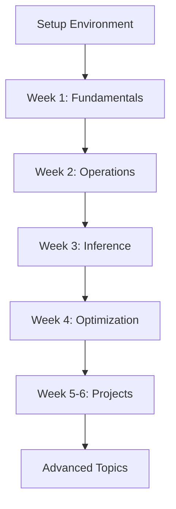

# 📂 Complete File Structure & Setup Guide

## 🎯 Overview

This document provides the **complete file structure** for both Python and Rust fuzzy logic study projects, with exact placement instructions for all files created.

---

## 🐍 Python Project Structure

### Directory Tree

```
python-fuzzy-logic/
├── .vscode/
│   ├── settings.json          ← VSCode Python settings
│   └── launch.json             ← Debug configurations
│
├── fuzzy_env/                  ← Virtual environment (created automatically)
│
├── src/
│   ├── __init__.py
│   ├── main.py                 ← Main interactive study program
│   └── fuzzy_utils.py          ← Utility functions and tools
│
├── examples/
│   ├── temperature_control.py  ← Temperature controller example
│   ├── tipping_system.py       ← Restaurant tipping system
│   └── image_processing.py     ← Advanced: Image processing (optional)
│
├── notebooks/
│   └── fuzzy_interactive.ipynb ← Jupyter notebook tutorial
│
├── tests/
│   ├── __init__.py
│   └── test_fuzzy.py           ← Unit tests
│
├── performance_comparison.py   ← Performance benchmark tool
├── requirements.txt            ← Python dependencies
└── README.md                   ← Project README
```

### File Placement Instructions

1. **Create base directory:**
   ```bash
   mkdir python-fuzzy-logic
   cd python-fuzzy-logic
   ```

2. **Create subdirectories:**
   ```bash
   mkdir -p src examples notebooks tests .vscode
   ```

3. **Place files:**
   - `.vscode/settings.json` → Copy from "VSCode Settings (Python)" artifact
   - `.vscode/launch.json` → Copy from "VSCode Launch Configuration" artifact
   - `src/main.py` → Copy from "Python Fuzzy Logic - Main Study Script" artifact
   - `src/fuzzy_utils.py` → Copy from "Python Utilities - fuzzy_utils.py" artifact
   - `examples/temperature_control.py` → Copy from "Python Example - temperature_control.py" artifact
   - `notebooks/fuzzy_interactive.ipynb` → Create notebook, copy from "Interactive Fuzzy Logic Notebook" artifact
   - `requirements.txt` → Copy from "requirements.txt - Python Dependencies" artifact
   - `performance_comparison.py` → Copy from "Performance Comparison Tool" artifact

4. **Create empty `__init__.py` files:**
   ```bash
   touch src/__init__.py tests/__init__.py
   ```

---

## 🦀 Rust Project Structure

### Directory Tree

```
rust-fuzzy-logic/
├── .vscode/
│   ├── settings.json          ← VSCode Rust settings
│   ├── tasks.json             ← Cargo tasks
│   └── launch.json            ← Debug configurations
│
├── src/
│   ├── lib.rs                 ← Main library
│   ├── main.rs                ← Interactive study program
│   ├── membership.rs          ← Membership functions
│   ├── operations.rs          ← Fuzzy operations
│   ├── inference.rs           ← Inference system
│   └── defuzzification.rs     ← Defuzzification methods
│
├── examples/
│   ├── temperature_controller.rs ← Temperature control example
│   ├── tipping_system.rs         ← Tipping system example
│   ├── membership_functions.rs   ← MF demonstrations
│   └── fuzzy_operations.rs       ← Operations demonstrations
│
├── tests/
│   └── integration_tests.rs   ← Integration tests
│
├── target/                     ← Build output (auto-generated)
│
├── Cargo.toml                  ← Rust dependencies and config
├── Cargo.lock                  ← Dependency lock file (auto-generated)
└── README.md                   ← Project README
```

### File Placement Instructions

1. **Create project with Cargo:**
   ```bash
   cargo new rust-fuzzy-logic
   cd rust-fuzzy-logic
   ```

2. **Create subdirectories:**
   ```bash
   mkdir -p examples tests .vscode
   ```

3. **Place files:**
   - `Cargo.toml` → Replace with "Rust Cargo.toml - Project Configuration" artifact
   - `.vscode/settings.json` → Copy from "VSCode Settings (Rust)" artifact
   - `.vscode/tasks.json` → Copy from "VSCode Tasks (Rust)" artifact
   - `.vscode/launch.json` → Copy from "VSCode Launch Configuration" artifact
   - `src/lib.rs` → Copy from "Rust lib.rs - Core Fuzzy Logic Library" artifact
   - `src/main.rs` → Copy from "Rust main.rs - Interactive Study Program" artifact
   - `src/membership.rs` → Copy from "Rust membership.rs - Membership Functions" artifact
   - `src/operations.rs` → Copy from "Rust operations.rs - Fuzzy Set Operations" artifact
   - `src/inference.rs` → Copy from "Rust inference.rs - Fuzzy Inference System" artifact
   - `src/defuzzification.rs` → Copy from "Rust defuzzification.rs - Defuzzification Methods" artifact
   - `examples/temperature_controller.rs` → Copy from "Rust Example - temperature_controller.rs" artifact
   - `examples/tipping_system.rs` → Copy from "Rust Example - tipping_system.rs" artifact
   - `tests/integration_tests.rs` → Copy from "Rust Tests - tests/integration_tests.rs" artifact

4. **Build project:**
   ```bash
   cargo build
   ```

---

## 🔧 Setup Scripts

### For Linux/Mac

**File:** `setup.sh`
**Location:** Place in parent directory of both projects

```
workspace/
├── setup.sh              ← Run this script
├── python-fuzzy-logic/   ← Will be created
└── rust-fuzzy-logic/     ← Will be created
```

**Usage:**
```bash
chmod +x setup.sh
./setup.sh
```

### For Windows

**File:** `setup.ps1`
**Location:** Place in parent directory of both projects

**Usage:**
```powershell
powershell -ExecutionPolicy Bypass -File setup.ps1
```

---

## 📚 Documentation Files

Place these in your workspace root or reference folders:

1. **README.md** → Copy from "Complete Setup Guide - README.md"
2. **TROUBLESHOOTING.md** → Copy from "Troubleshooting & FAQ Guide"
3. **CHEATSHEET.md** → Copy from "Fuzzy Logic Quick Reference Cheatsheet"
4. **STUDY_GUIDE.md** → Copy from "Complete Learning Roadmap & Study Guide"

**Suggested structure:**
```
workspace/
├── docs/
│   ├── README.md
│   ├── TROUBLESHOOTING.md
│   ├── CHEATSHEET.md
│   └── STUDY_GUIDE.md
├── python-fuzzy-logic/
└── rust-fuzzy-logic/
```

---

## 🚀 Quick Start

### Step 1: Run Setup Script

**Linux/Mac:**
```bash
cd workspace
bash setup.sh
```

**Windows:**
```powershell
cd workspace
powershell -ExecutionPolicy Bypass -File setup.ps1
```

### Step 2: Copy Source Files

After running the setup script, manually copy the source files from the artifacts into the appropriate directories as listed above.

### Step 3: Python - Install Dependencies

```bash
cd python-fuzzy-logic
source fuzzy_env/bin/activate  # Linux/Mac
# or
.\fuzzy_env\Scripts\Activate.ps1  # Windows

pip install -r requirements.txt
```

### Step 4: Rust - Build Project

```bash
cd rust-fuzzy-logic
cargo build
cargo test
```

### Step 5: Open in VSCode

**Option 1: Open workspace**
```bash
cd workspace
code fuzzy-logic.code-workspace
```

**Option 2: Open individual projects**
```bash
code python-fuzzy-logic/
# or
code rust-fuzzy-logic/
```

---

## ✅ Verification Checklist

### Python Project
- [ ] Virtual environment created
- [ ] Dependencies installed
- [ ] Can run: `python src/main.py`
- [ ] Can run: `python examples/temperature_control.py`
- [ ] Can open: `jupyter notebook notebooks/`
- [ ] VSCode recognizes Python interpreter

### Rust Project
- [ ] Project compiles: `cargo build`
- [ ] Tests pass: `cargo test`
- [ ] Can run: `cargo run`
- [ ] Can run: `cargo run --example temperature_controller`
- [ ] rust-analyzer works in VSCode

---

## 🎯 Next Steps

1. **Read the study guide:** `docs/STUDY_GUIDE.md`
2. **Follow Week 1 lessons** in both Python and Rust
3. **Try all examples** to understand the concepts
4. **Complete exercises** from the study guide
5. **Build your own fuzzy system**
6. **Compare Python vs Rust** implementations
7. **Benchmark performance** using `performance_comparison.py`

---

## 💡 Pro Tips

### For Python Development
- Use Jupyter notebooks for interactive learning
- Visualize every membership function you create
- Test with `pytest` as you build
- Profile with `cProfile` for optimization

### For Rust Development
- Run `cargo check` frequently while developing
- Use `cargo clippy` for linting
- Read compiler error messages carefully
- Use `cargo doc --open` to browse documentation

### For Both
- Start with simple examples
- Build complexity gradually
- Test edge cases
- Document your code
- Version control with git

---

## 🆘 Troubleshooting

If you encounter issues:

1. **Check TROUBLESHOOTING.md** for common problems
2. **Verify file structure** matches this guide
3. **Check versions:**
   ```bash
   # Python
   python --version  # Should be 3.8+
   pip list | grep scikit-fuzzy

   # Rust
   cargo --version  # Should be 1.70+
   rustc --version
   ```
4. **Clean and rebuild:**
   ```bash
   # Python
   pip install -r requirements.txt --force-reinstall

   # Rust
   cargo clean && cargo build
   ```

---

## 📊 Project Statistics

### Python Project
- **Files:** ~12 source files
- **Lines of Code:** ~3,000+
- **Examples:** 3-5 complete applications
- **Tests:** Comprehensive test suite

### Rust Project
- **Files:** ~10 source files
- **Lines of Code:** ~2,500+
- **Examples:** 4 complete applications
- **Tests:** Integration test suite

---

## 🎓 Learning Path



**Timeline:**
- **Setup:** 1-2 hours
- **Fundamentals:** 1 week
- **Advanced:** 2-3 weeks
- **Projects:** 2-3 weeks
- **Total:** 6-8 weeks to proficiency

---

## 📦 Additional Resources

### Artifacts Created (28 Total)

**Python (9):**
1. Main study script
2. Utilities module
3. Temperature control example
4. Interactive notebook
5. Requirements file
6. VSCode settings
7. Launch config
8. Performance tool
9. Example tipping system

**Rust (12):**
1. Cargo.toml
2. lib.rs
3. main.rs
4. membership.rs
5. operations.rs
6. inference.rs
7. defuzzification.rs
8. Temperature example
9. Tipping example
10. VSCode settings
11. Tasks config
12. Integration tests

**Documentation (7):**
1. Complete README
2. Troubleshooting guide
3. Cheatsheet
4. Study guide
5. Setup script (Bash)
6. Setup script (PowerShell)
7. File structure guide (this document)

---

## 🎉 You're Ready!

You now have everything needed to:
- ✅ Set up both Python and Rust environments
- ✅ Learn fuzzy logic systematically
- ✅ Build real-world applications
- ✅ Compare language implementations
- ✅ Optimize for performance
- ✅ Debug and troubleshoot

**Happy learning! 🚀🧠**

---

## 📞 Support

Questions? Check these resources:
- **Troubleshooting:** TROUBLESHOOTING.md
- **Quick Reference:** CHEATSHEET.md
- **Learning Path:** STUDY_GUIDE.md
- **GitHub Issues:** (Your repository)
- **Stack Overflow:** Tag `fuzzy-logic`

**Remember:** The best way to learn is by doing. Start coding! 💻
