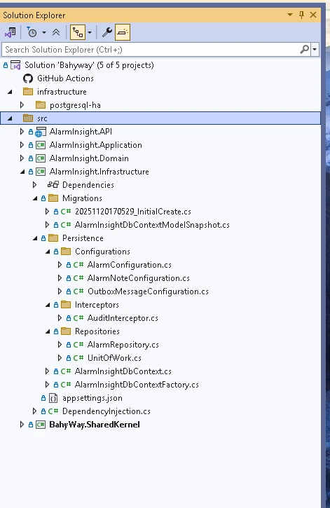
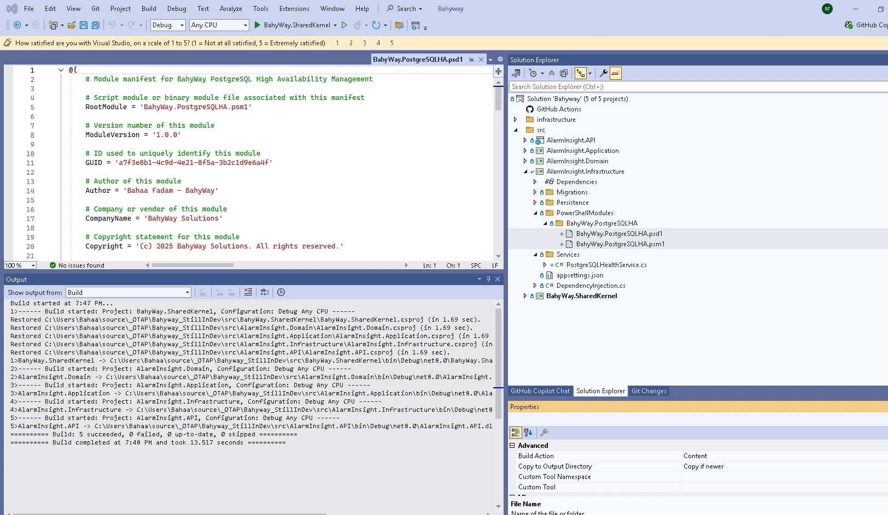
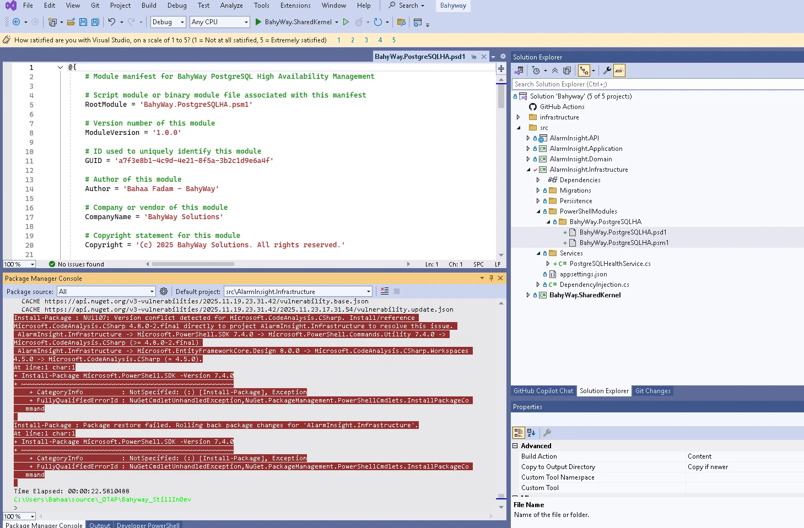
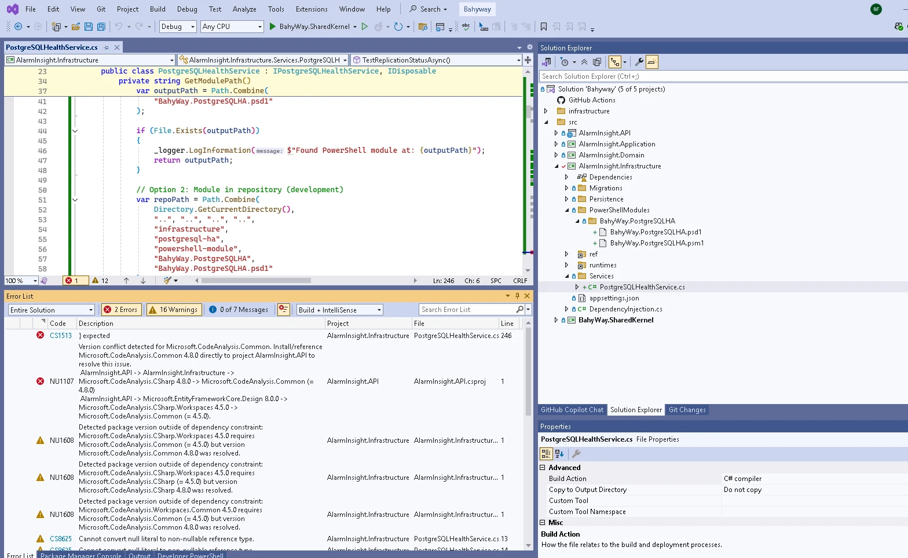
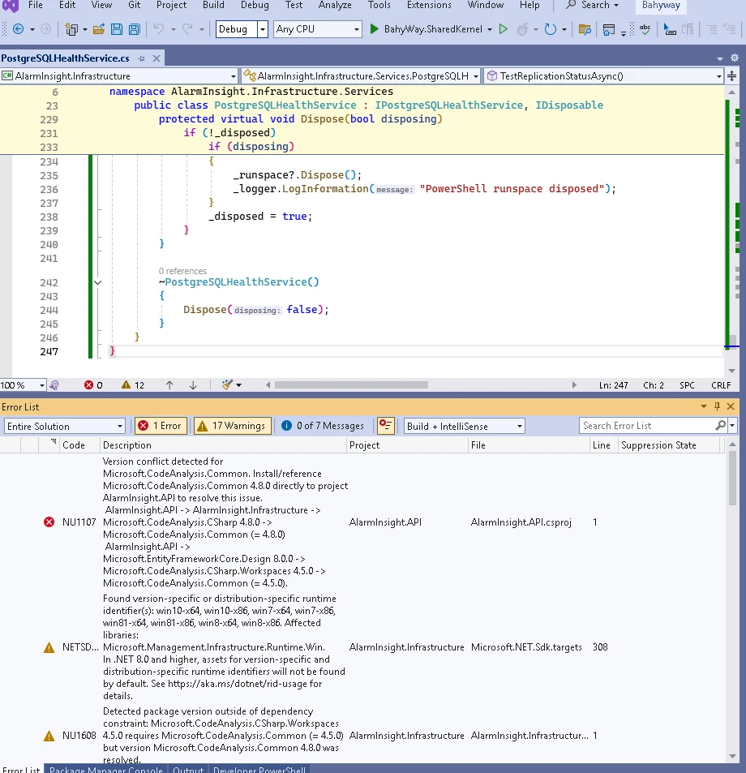

# PostgreSQL HA PowerShell Module - C# Integration Q&A
## Question01:
How can I add the PowerShell Module for PostgreSQL Replication to my C# (.NET) BahyWay Solution?

## Answer01:
The BahyWay PostgreSQL HA PowerShell module can be integrated into your C# .NET solution using the Microsoft.PowerShell.SDK package. This allows you to execute PowerShell commands directly from C# code.

📦 Module Information
Module Name: BahyWay.PostgreSQLHA
Version: 1.0.0
Author: Bahaa Fadam - BahyWay Solutions
Location: infrastructure/postgresql-ha/powershell-module/BahyWay.PostgreSQLHA/

Files:

BahyWay.PostgreSQLHA.psd1 (Module Manifest)
BahyWay.PostgreSQLHA.psm1 (Module Script - 1165 lines)
⚡ Quick Integration Steps
Step 1: Add NuGet Package
Add to your AlarmInsight.Infrastructure project:

Install-Package Microsoft.PowerShell.SDK -Version 7.4.0
Or add to .csproj:

<PackageReference Include="Microsoft.PowerShell.SDK" Version="7.4.0" />
Step 2: Add PowerShell Module to Project
In Visual Studio → Right-click AlarmInsight.Infrastructure project
Add → New Folder → Name: PowerShellModules
Add → New Folder → Name: BahyWay.PostgreSQLHA
Add → Existing Item → Browse to module files
Select both .psd1 and .psm1 files
Set Properties (F4):
Build Action: Content
Copy to Output Directory: Copy if newer
Step 3: Create C# Service Wrapper
Create Services/PostgreSQLHealthService.cs:

using System;
using System.Collections.Generic;
using System.Collections.ObjectModel;
using System.IO;
using System.Linq;
using System.Management.Automation;
using System.Management.Automation.Runspaces;
using System.Threading.Tasks;
using Microsoft.Extensions.Logging;

namespace AlarmInsight.Infrastructure.Services
{
    public interface IPostgreSQLHealthService
    {
        Task<Dictionary<string, object>> GetClusterHealthAsync(
            bool includeHAProxy = false,
            bool includeBarman = false);

        Task<Dictionary<string, object>> TestDockerEnvironmentAsync();
        Task<Dictionary<string, object>> TestPrimaryNodeAsync(string containerName = null);
        Task<Dictionary<string, object>> TestReplicaNodeAsync(string containerName = null);
        Task<Dictionary<string, object>> TestReplicationStatusAsync();
        Task<List<Dictionary<string, object>>> GetHealthAlarmsAsync();

        Task<Collection<PSObject>> InvokePowerShellAsync(
            string command,
            Dictionary<string, object> parameters = null);
    }

    public class PostgreSQLHealthService : IPostgreSQLHealthService, IDisposable
    {
        private readonly ILogger<PostgreSQLHealthService> _logger;
        private readonly string _modulePath;
        private Runspace _runspace;
        private bool _disposed = false;

        public PostgreSQLHealthService(ILogger<PostgreSQLHealthService> logger)
        {
            _logger = logger;
            _modulePath = GetModulePath();
            InitializeRunspace();
        }

        private string GetModulePath()
        {
            // Option 1: Module in output directory (deployment)
            var outputPath = Path.Combine(
                AppContext.BaseDirectory,
                "PowerShellModules",
                "BahyWay.PostgreSQLHA",
                "BahyWay.PostgreSQLHA.psd1"
            );

            if (File.Exists(outputPath))
            {
                _logger.LogInformation($"Found PowerShell module at: {outputPath}");
                return outputPath;
            }

            // Option 2: Module in repository (development)
            var repoPath = Path.Combine(
                Directory.GetCurrentDirectory(),
                "..", "..", "..", "..",
                "infrastructure",
                "postgresql-ha",
                "powershell-module",
                "BahyWay.PostgreSQLHA",
                "BahyWay.PostgreSQLHA.psd1"
            );

            if (File.Exists(repoPath))
            {
                _logger.LogInformation($"Found PowerShell module at: {repoPath}");
                return Path.GetFullPath(repoPath);
            }

            throw new FileNotFoundException(
                "PowerShell module not found. Searched: " +
                $"{outputPath}, {repoPath}"
            );
        }

        private void InitializeRunspace()
        {
            try
            {
                var initialSessionState = InitialSessionState.CreateDefault();
                initialSessionState.ExecutionPolicy =
                    Microsoft.PowerShell.ExecutionPolicy.RemoteSigned;

                _runspace = RunspaceFactory.CreateRunspace(initialSessionState);
                _runspace.Open();

                using var pipeline = _runspace.CreatePipeline();
                pipeline.Commands.AddScript($"Import-Module '{_modulePath}' -Force");
                pipeline.Invoke();

                _logger.LogInformation("PowerShell runspace initialized");
            }
            catch (Exception ex)
            {
                _logger.LogError(ex, "Failed to initialize PowerShell runspace");
                throw;
            }
        }

        public async Task<Dictionary<string, object>> GetClusterHealthAsync(
            bool includeHAProxy = false,
            bool includeBarman = false)
        {
            var parameters = new Dictionary<string, object>();
            if (includeHAProxy) parameters["IncludeHAProxy"] = true;
            if (includeBarman) parameters["IncludeBarman"] = true;

            var result = await InvokePowerShellAsync("Get-ClusterHealth", parameters);
            return ConvertPSObjectToDictionary(result.FirstOrDefault());
        }

        public async Task<Dictionary<string, object>> TestDockerEnvironmentAsync()
        {
            var result = await InvokePowerShellAsync("Test-DockerEnvironment");
            return ConvertPSObjectToDictionary(result.FirstOrDefault());
        }

        public async Task<Dictionary<string, object>> TestPrimaryNodeAsync(
            string containerName = null)
        {
            var parameters = new Dictionary<string, object>();
            if (!string.IsNullOrEmpty(containerName))
                parameters["ContainerName"] = containerName;

            var result = await InvokePowerShellAsync("Test-PostgreSQLPrimary", parameters);
            return ConvertPSObjectToDictionary(result.FirstOrDefault());
        }

        public async Task<Dictionary<string, object>> TestReplicaNodeAsync(
            string containerName = null)
        {
            var parameters = new Dictionary<string, object>();
            if (!string.IsNullOrEmpty(containerName))
                parameters["ContainerName"] = containerName;

            var result = await InvokePowerShellAsync("Test-PostgreSQLReplica", parameters);
            return ConvertPSObjectToDictionary(result.FirstOrDefault());
        }

        public async Task<Dictionary<string, object>> TestReplicationStatusAsync()
        {
            var result = await InvokePowerShellAsync("Test-PostgreSQLReplication");
            return ConvertPSObjectToDictionary(result.FirstOrDefault());
        }

        public async Task<List<Dictionary<string, object>>> GetHealthAlarmsAsync()
        {
            var result = await InvokePowerShellAsync("Get-HealthAlarms");
            return result.Select(ConvertPSObjectToDictionary).ToList();
        }

        public async Task<Collection<PSObject>> InvokePowerShellAsync(
            string command,
            Dictionary<string, object> parameters = null)
        {
            return await Task.Run(() =>
            {
                try
                {
                    using var pipeline = _runspace.CreatePipeline();
                    var cmd = new Command(command);

                    if (parameters != null)
                    {
                        foreach (var param in parameters)
                        {
                            cmd.Parameters.Add(param.Key, param.Value);
                        }
                    }

                    pipeline.Commands.Add(cmd);
                    _logger.LogDebug($"Executing PowerShell: {command}");

                    var results = pipeline.Invoke();

                    if (pipeline.Error.Count > 0)
                    {
                        var errors = pipeline.Error.ReadToEnd()
                            .Select(e => e.ToString()).ToList();
                        _logger.LogWarning(
                            $"PowerShell '{command}' completed with errors: " +
                            string.Join("; ", errors)
                        );
                    }

                    return results;
                }
                catch (Exception ex)
                {
                    _logger.LogError(ex, $"Error executing PowerShell: {command}");
                    throw;
                }
            });
        }

        private Dictionary<string, object> ConvertPSObjectToDictionary(PSObject psObject)
        {
            if (psObject == null)
                return new Dictionary<string, object>();

            var dict = new Dictionary<string, object>();

            foreach (var property in psObject.Properties)
            {
                var value = property.Value;

                if (value is PSObject nestedPsObject)
                {
                    value = ConvertPSObjectToDictionary(nestedPsObject);
                }
                else if (value is object[] array)
                {
                    value = array.Select(item =>
                        item is PSObject pso
                            ? ConvertPSObjectToDictionary(pso)
                            : item
                    ).ToList();
                }

                dict[property.Name] = value;
            }

            return dict;
        }

        public void Dispose()
        {
            Dispose(true);
            GC.SuppressFinalize(this);
        }

        protected virtual void Dispose(bool disposing)
        {
            if (!_disposed)
            {
                if (disposing)
                {
                    _runspace?.Dispose();
                    _logger.LogInformation("PowerShell runspace disposed");
                }
                _disposed = true;
            }
        }

        ~PostgreSQLHealthService()
        {
            Dispose(false);
        }
    }
}
Step 4: Register Service in DI
For .NET 6+ (Program.cs):

using AlarmInsight.Infrastructure.Services;

var builder = WebApplication.CreateBuilder(args);

builder.Services.AddControllers();

// Add PostgreSQL Health Service
builder.Services.AddScoped<IPostgreSQLHealthService, PostgreSQLHealthService>();

var app = builder.Build();
app.MapControllers();
app.Run();
For .NET 5 and earlier (Startup.cs):

public void ConfigureServices(IServiceCollection services)
{
    services.AddControllers();
    services.AddScoped<IPostgreSQLHealthService, PostgreSQLHealthService>();
}
Step 5: Create API Controller (Optional)
Create Controllers/PostgreSQLHealthController.cs:

using Microsoft.AspNetCore.Mvc;
using Microsoft.Extensions.Logging;
using System;
using System.Threading.Tasks;
using AlarmInsight.Infrastructure.Services;

namespace AlarmInsight.API.Controllers
{
    [ApiController]
    [Route("api/postgresql")]
    public class PostgreSQLHealthController : ControllerBase
    {
        private readonly IPostgreSQLHealthService _healthService;
        private readonly ILogger<PostgreSQLHealthController> _logger;

        public PostgreSQLHealthController(
            IPostgreSQLHealthService healthService,
            ILogger<PostgreSQLHealthController> logger)
        {
            _healthService = healthService;
            _logger = logger;
        }

        /// <summary>
        /// GET: api/postgresql/health
        /// </summary>
        [HttpGet("health")]
        public async Task<IActionResult> GetClusterHealth(
            [FromQuery] bool includeHAProxy = false,
            [FromQuery] bool includeBarman = false)
        {
            try
            {
                var health = await _healthService.GetClusterHealthAsync(
                    includeHAProxy, includeBarman);

                var isHealthy = health.TryGetValue("IsHealthy", out var status)
                    && status is bool healthy && healthy;

                return Ok(new
                {
                    timestamp = DateTime.UtcNow,
                    healthy = isHealthy,
                    details = health
                });
            }
            catch (Exception ex)
            {
                _logger.LogError(ex, "Error getting cluster health");
                return StatusCode(500, new { error = ex.Message });
            }
        }

        /// <summary>
        /// GET: api/postgresql/docker
        /// </summary>
        [HttpGet("docker")]
        public async Task<IActionResult> TestDocker()
        {
            try
            {
                var result = await _healthService.TestDockerEnvironmentAsync();
                return Ok(result);
            }
            catch (Exception ex)
            {
                _logger.LogError(ex, "Error testing Docker");
                return StatusCode(500, new { error = ex.Message });
            }
        }

        /// <summary>
        /// GET: api/postgresql/primary
        /// </summary>
        [HttpGet("primary")]
        public async Task<IActionResult> TestPrimary(
            [FromQuery] string containerName = null)
        {
            try
            {
                var result = await _healthService.TestPrimaryNodeAsync(containerName);
                return Ok(result);
            }
            catch (Exception ex)
            {
                _logger.LogError(ex, "Error testing primary");
                return StatusCode(500, new { error = ex.Message });
            }
        }

        /// <summary>
        /// GET: api/postgresql/replica
        /// </summary>
        [HttpGet("replica")]
        public async Task<IActionResult> TestReplica(
            [FromQuery] string containerName = null)
        {
            try
            {
                var result = await _healthService.TestReplicaNodeAsync(containerName);
                return Ok(result);
            }
            catch (Exception ex)
            {
                _logger.LogError(ex, "Error testing replica");
                return StatusCode(500, new { error = ex.Message });
            }
        }

        /// <summary>
        /// GET: api/postgresql/replication
        /// </summary>
        [HttpGet("replication")]
        public async Task<IActionResult> GetReplicationStatus()
        {
            try
            {
                var result = await _healthService.TestReplicationStatusAsync();
                return Ok(result);
            }
            catch (Exception ex)
            {
                _logger.LogError(ex, "Error getting replication status");
                return StatusCode(500, new { error = ex.Message });
            }
        }

        /// <summary>
        /// GET: api/postgresql/alarms
        /// </summary>
        [HttpGet("alarms")]
        public async Task<IActionResult> GetAlarms()
        {
            try
            {
                var alarms = await _healthService.GetHealthAlarmsAsync();
                return Ok(new { count = alarms.Count, alarms });
            }
            catch (Exception ex)
            {
                _logger.LogError(ex, "Error getting alarms");
                return StatusCode(500, new { error = ex.Message });
            }
        }

        /// <summary>
        /// GET: api/postgresql/healthz
        /// </summary>
        [HttpGet("healthz")]
        public async Task<IActionResult> HealthCheck()
        {
            try
            {
                var health = await _healthService.GetClusterHealthAsync();
                var isHealthy = health.TryGetValue("IsHealthy", out var status)
                    && status is bool healthy && healthy;

                if (isHealthy)
                    return Ok(new { status = "healthy" });
                else
                    return StatusCode(503, new
                    {
                        status = "unhealthy",
                        issues = health.TryGetValue("AllIssues", out var issues)
                            ? issues : null
                    });
            }
            catch (Exception ex)
            {
                _logger.LogError(ex, "Health check failed");
                return StatusCode(503, new { status = "error", message = ex.Message });
            }
        }
    }
}
🚀 Available PowerShell Functions
Health Check Functions
Test-DockerEnvironment - Validates Docker installation and daemon
Test-PostgreSQLPrimary - Checks primary node health
Test-PostgreSQLReplica - Checks replica node health
Test-PostgreSQLReplication - Validates replication status
Get-ClusterHealth - Comprehensive cluster health check
Monitoring Functions
Get-ReplicationStatus - Current replication state
Get-ReplicationLag - Replication lag in seconds
Get-DatabaseSize - Database size metrics
Get-ConnectionCount - Active database connections
Alarm Functions
Get-HealthAlarms - Retrieve all health alarms
Clear-HealthAlarms - Clear alarm history
Send-HealthAlarm - Create custom alarm
📊 API Endpoints
After implementing the controller:

Endpoint	Method	Description
/api/postgresql/health	GET	Full cluster health status
/api/postgresql/docker	GET	Docker environment check
/api/postgresql/primary	GET	Primary node status
/api/postgresql/replica	GET	Replica node status
/api/postgresql/replication	GET	Replication metrics
/api/postgresql/alarms	GET	Active alarms
/api/postgresql/healthz	GET	Simple health endpoint
💡 Usage Examples
Example 1: Basic Health Check
public class MonitoringService
{
    private readonly IPostgreSQLHealthService _health;

    public MonitoringService(IPostgreSQLHealthService health)
    {
        _health = health;
    }

    public async Task CheckHealth()
    {
        var health = await _health.GetClusterHealthAsync();

        if (!(bool)health["IsHealthy"])
        {
            // Alert team
            await SendAlert("Database cluster unhealthy!");
        }
    }
}
Example 2: Background Monitoring
public class DatabaseMonitor : BackgroundService
{
    private readonly IServiceProvider _services;
    private readonly ILogger<DatabaseMonitor> _logger;

    public DatabaseMonitor(IServiceProvider services, ILogger<DatabaseMonitor> logger)
    {
        _services = services;
        _logger = logger;
    }

    protected override async Task ExecuteAsync(CancellationToken stoppingToken)
    {
        while (!stoppingToken.IsCancellationRequested)
        {
            using var scope = _services.CreateScope();
            var healthService = scope.ServiceProvider
                .GetRequiredService<IPostgreSQLHealthService>();

            var health = await healthService.GetClusterHealthAsync();

            if (!(bool)health["IsHealthy"])
            {
                _logger.LogError("Cluster unhealthy!");
            }

            await Task.Delay(TimeSpan.FromMinutes(5), stoppingToken);
        }
    }
}
🐛 Troubleshooting
Issue 1: Module Not Found
Error: FileNotFoundException: PowerShell module not found

Solution:

Verify files in bin/Debug/net6.0/PowerShellModules/BahyWay.PostgreSQLHA/
Check file properties: Copy to Output Directory = Copy if newer
Rebuild solution
Issue 2: Execution Policy
Error: Execution policy restriction

Solution:

Set-ExecutionPolicy RemoteSigned -Scope CurrentUser
Issue 3: Docker Not Running
Error: Docker daemon is not running

Solution:

Start Docker Desktop
Test: docker ps
✅ Integration Checklist
 NuGet package Microsoft.PowerShell.SDK installed
 PowerShell module files added to project
 File properties set correctly (Content, Copy if newer)
 PostgreSQLHealthService.cs created
 Service registered in DI container
 Solution builds without errors
 API endpoints working
 Docker accessible
📚 Module Features
✅ Cross-platform (Windows WSL2, Linux, macOS)
✅ Comprehensive health monitoring
✅ Alarm detection system
✅ Replication lag tracking
✅ Docker validation
✅ HAProxy & Barman support
✅ Try-Catch-Finally error handling
✅ Structured logging

Copyright © 2025 BahyWay Solutions. All rights reserved.

There you go! Copy this entire markdown, name it as you like, add it to your StepByStepLab documentation, and implement the C# code in your BahyWay solution whenever you're ready! 😊

## Question02:
Yes this workflow is correct. my question again is this: You already provided the PowerShell Module (See the screenshot), now the question is where ( in which filesystem structure) under the project "BahyWay", I must put the PowerShell Module, so that I will use either C# Warper or Ansible Playbook to run it?

## Answer02:
The PowerShell module location depends on how you plan to use it. Here are the recommended filesystem structures for both scenarios:

📂 Option 1: For C# Wrapper Usage (Recommended)
Location in BahyWay Solution:
BahyWay/                                    (Solution root)
├── src/
│   ├── AlarmInsight.API/
│   ├── AlarmInsight.Application/
│   ├── AlarmInsight.Domain/
│   ├── AlarmInsight.Infrastructure/
│   │   ├── Services/
│   │   │   └── PostgreSQLHealthService.cs
│   │   ├── PowerShellModules/              ⭐ CREATE THIS
│   │   │   └── BahyWay.PostgreSQLHA/
│   │   │       ├── BahyWay.PostgreSQLHA.psd1
│   │   │       └── BahyWay.PostgreSQLHA.psm1
│   │   └── AlarmInsight.Infrastructure.csproj
│   └── BahyWay.SharedKernel/
└── infrastructure/
Steps:
In Visual Studio, open BahyWay solution
Right-click AlarmInsight.Infrastructure project
Add → New Folder: PowerShellModules
Add → New Folder: BahyWay.PostgreSQLHA
Add → Existing Item: Select both .psd1 and .psm1 files
Set file properties (F4):
Build Action: Content
Copy to Output Directory: Copy if newer
Result:
Files will be copied to: bin/Debug/net6.0/PowerShellModules/BahyWay.PostgreSQLHA/

Why This Location?
✅ Integrated with .NET build process
✅ Deployed automatically with application
✅ Easy access from C# code
✅ Version controlled with application code
##===================================================
## Question03:
You mean in this location:


## Answer03:
Yes, exactly! Based on your screenshot, here's what you should do:

✅ For C# Wrapper Usage (Your Current Structure)
In Visual Studio, in your AlarmInsight.Infrastructure project:

Right-click AlarmInsight.Infrastructure project (the one shown expanded in your screenshot)
Add → New Folder → Name it: PowerShellModules
Right-click PowerShellModules → Add → New Folder → Name it: BahyWay.PostgreSQLHA
Right-click BahyWay.PostgreSQLHA → Add → Existing Item
Browse to where you have the module files and select:
BahyWay.PostgreSQLHA.psd1
BahyWay.PostgreSQLHA.psm1
Important: Select both files → Press F4 → Set properties:
Build Action: Content
Copy to Output Directory: Copy if newer
📂 Your Structure Will Look Like:
AlarmInsight.Infrastructure
├── Dependencies
├── Migrations
├── Persistence
│   └── Configurations
├── Interceptors
├── Repositories
├── PowerShellModules/           ⭐ NEW FOLDER
│   └── BahyWay.PostgreSQLHA/
│       ├── BahyWay.PostgreSQLHA.psd1
│       └── BahyWay.PostgreSQLHA.psm1
├── Services/                    ⭐ CREATE THIS TOO
│   └── PostgreSQLHealthService.cs
├── appsettings.json
└── DependencyInjection.cs
🎯 Next Steps:
Create PowerShellModules folder in AlarmInsight.Infrastructure
Add the module files
Create Services folder (if it doesn't exist)
Add PostgreSQLHealthService.cs to Services folder
Build the solution
The files will then be automatically copied to:

bin/Debug/net6.0/PowerShellModules/BahyWay.PostgreSQLHA/
This is the simplest approach for C# usage! 👍
##===================================================
📂 Option 2: For Ansible Playbook Usage
Location in BahyWay Solution:
BahyWay/                                    (Solution root)
├── src/
│   ├── AlarmInsight.API/
│   ├── AlarmInsight.Application/
│   └── ...
├── infrastructure/
│   ├── ansible/
│   │   ├── playbooks/
│   │   │   └── deploy-postgresql-ha.yml
│   │   ├── roles/
│   │   │   └── postgresql-ha/
│   │   │       ├── tasks/
│   │   │       ├── templates/
│   │   │       └── files/
│   │   │           └── BahyWay.PostgreSQLHA/    ⭐ PUT HERE
│   │   │               ├── BahyWay.PostgreSQLHA.psd1
│   │   │               └── BahyWay.PostgreSQLHA.psm1
│   │   └── inventory/
│   ├── docker/
│   └── scripts/
Ansible Playbook Example:
---
- name: Deploy PostgreSQL HA PowerShell Module
  hosts: database_servers
  become: yes

  tasks:
    - name: Create PowerShell modules directory
      file:
        path: /usr/local/share/powershell/Modules/BahyWay.PostgreSQLHA
        state: directory
        mode: '0755'

    - name: Copy PowerShell module files
      copy:
        src: "files/BahyWay.PostgreSQLHA/{{ item }}"
        dest: /usr/local/share/powershell/Modules/BahyWay.PostgreSQLHA/
        mode: '0644'
      loop:
        - BahyWay.PostgreSQLHA.psd1
        - BahyWay.PostgreSQLHA.psm1

    - name: Test module import
      shell: pwsh -Command "Import-Module BahyWay.PostgreSQLHA -Force; Get-Module"
      register: module_test

    - name: Run health check
      shell: pwsh -Command "Import-Module BahyWay.PostgreSQLHA; Get-ClusterHealth"
      register: health_result

    - name: Display health check result
      debug:
        var: health_result.stdout
Why This Location?
✅ Standard Ansible role structure
✅ Easy to deploy to servers
✅ Separate from application code
✅ Reusable across multiple playbooks

📂 Option 3: Shared Location (Both C# and Ansible)
Location in BahyWay Solution:
BahyWay/                                    (Solution root)
├── src/
│   ├── AlarmInsight.Infrastructure/
│   │   ├── Services/
│   │   │   └── PostgreSQLHealthService.cs
│   │   └── PowerShellModules/              ⭐ LINK TO SHARED
│   │       └── BahyWay.PostgreSQLHA/       (Add as Link)
│   └── ...
├── infrastructure/
│   ├── powershell-modules/                 ⭐ MASTER LOCATION
│   │   └── BahyWay.PostgreSQLHA/
│   │       ├── BahyWay.PostgreSQLHA.psd1
│   │       └── BahyWay.PostgreSQLHA.psm1
│   ├── ansible/
│   │   └── roles/
│   │       └── postgresql-ha/
│   │           └── tasks/
│   │               └── deploy-module.yml
│   └── docker/
Steps for Shared Location:
Place master files in infrastructure/powershell-modules/BahyWay.PostgreSQLHA/

Link to C# project:

Right-click AlarmInsight.Infrastructure → Add → Existing Item
Browse to infrastructure/powershell-modules/BahyWay.PostgreSQLHA/
Select files, click dropdown on "Add" button
Choose "Add As Link"
Set properties: Build Action = Content, Copy to Output = Copy if newer
Reference in Ansible:

- name: Copy PowerShell module
  copy:
    src: "../../powershell-modules/BahyWay.PostgreSQLHA/"
    dest: /usr/local/share/powershell/Modules/BahyWay.PostgreSQLHA/
Why This Location?
✅ Single source of truth
✅ No file duplication
✅ Easier version control
✅ Works for both C# and Ansible

🎯 Recommendation Summary
Use Case	Recommended Location	Why
C# Only	src/AlarmInsight.Infrastructure/PowerShellModules/	Simple, integrated
Ansible Only	infrastructure/ansible/roles/postgresql-ha/files/	Standard Ansible structure
Both C# and Ansible	infrastructure/powershell-modules/ (with links)	Single source, no duplication
🛠️ Installation Paths on Target Systems
Windows:
# User modules
$env:USERPROFILE\Documents\PowerShell\Modules\BahyWay.PostgreSQLHA\

# System modules
C:\Program Files\PowerShell\Modules\BahyWay.PostgreSQLHA\
Linux/macOS:
# User modules
~/.local/share/powershell/Modules/BahyWay.PostgreSQLHA/

# System modules
/usr/local/share/powershell/Modules/BahyWay.PostgreSQLHA/
📝 Example: Deploy with Ansible to Target Server
---
- name: Install BahyWay PostgreSQL HA Module
  hosts: database_servers
  become: yes
  vars:
    module_name: BahyWay.PostgreSQLHA
    module_path: /usr/local/share/powershell/Modules

  tasks:
    - name: Ensure PowerShell is installed
      package:
        name: powershell
        state: present

    - name: Create module directory
      file:
        path: "{{ module_path }}/{{ module_name }}"
        state: directory
        owner: root
        group: root
        mode: '0755'

    - name: Copy module manifest
      copy:
        src: "files/{{ module_name }}/{{ module_name }}.psd1"
        dest: "{{ module_path }}/{{ module_name }}/"
        owner: root
        group: root
        mode: '0644'

    - name: Copy module script
      copy:
        src: "files/{{ module_name }}/{{ module_name }}.psm1"
        dest: "{{ module_path }}/{{ module_name }}/"
        owner: root
        group: root
        mode: '0644'

    - name: Verify module installation
      shell: |
        pwsh -Command "Import-Module {{ module_name }} -Force; Get-Module {{ module_name }}"
      register: verify_result
      changed_when: false

    - name: Display verification result
      debug:
        msg: "Module installed: {{ verify_result.stdout }}"

    - name: Run initial health check
      shell: |
        pwsh -Command "Import-Module {{ module_name }}; Test-DockerEnvironment | ConvertTo-Json"
      register: health_check
      ignore_errors: yes

    - name: Display health check
      debug:
        var: health_check.stdout
🔧 C# Code Path Resolution
The PostgreSQLHealthService.cs will automatically find the module in these locations:

private string GetModulePath()
{
    // 1. Check deployed location (production)
    var deployedPath = Path.Combine(
        AppContext.BaseDirectory,
        "PowerShellModules",
        "BahyWay.PostgreSQLHA",
        "BahyWay.PostgreSQLHA.psd1"
    );

    if (File.Exists(deployedPath))
        return deployedPath;

    // 2. Check repository location (development)
    var repoPath = Path.Combine(
        Directory.GetCurrentDirectory(),
        "..", "..", "..", "..",
        "infrastructure",
        "powershell-modules",
        "BahyWay.PostgreSQLHA",
        "BahyWay.PostgreSQLHA.psd1"
    );

    if (File.Exists(repoPath))
        return Path.GetFullPath(repoPath);

    throw new FileNotFoundException("PowerShell module not found");
}
✅ Final Recommendation
For your BahyWay solution, use Option 3 (Shared Location):

BahyWay/
├── infrastructure/
│   └── powershell-modules/
│       └── BahyWay.PostgreSQLHA/
│           ├── BahyWay.PostgreSQLHA.psd1
│           └── BahyWay.PostgreSQLHA.psm1
Then:

Link it to AlarmInsight.Infrastructure for C# usage
Reference it in Ansible roles for deployment
This gives you: ✅ Single source of truth
✅ Easy version control
✅ Works with both C# and Ansible
✅ Clean separation of infrastructure code

Copyright © 2025 BahyWay Solutions. All rights reserved.

## Question04:
I use Option 1, I rebuild the solution , what are the following instructions now?


## Answer04:
Perfect! Your build succeeded! ✅

Now here are the next steps:

Next Steps After Adding PowerShell Module Files
Step 1: Add NuGet Package (1 minute)
In Visual Studio, go to Tools → NuGet Package Manager → Package Manager Console
In the console, select AlarmInsight.Infrastructure from the dropdown
Run this command:
Install-Package Microsoft.PowerShell.SDK -Version 7.4.0
OR add to your AlarmInsight.Infrastructure.csproj:

<ItemGroup>
  <PackageReference Include="Microsoft.PowerShell.SDK" Version="7.4.0" />
</ItemGroup>
Step 2: Create PostgreSQLHealthService.cs (2 minutes)
Right-click Services folder (I see it's already there!)
Add → Class → Name: PostgreSQLHealthService.cs
Copy the entire code from the Q&A document I provided earlier (the C# service code)
Paste into PostgreSQLHealthService.cs
Step 3: Register Service in DI Container (30 seconds)
Open your DependencyInjection.cs file in AlarmInsight.Infrastructure

Add this line in the service registration section:

services.AddScoped<IPostgreSQLHealthService, PostgreSQLHealthService>();
Full example:

using AlarmInsight.Infrastructure.Services;

public static class DependencyInjection
{
    public static IServiceCollection AddInfrastructure(
        this IServiceCollection services,
        IConfiguration configuration)
    {
        // ... your existing services ...

        // Add PostgreSQL Health Service
        services.AddScoped<IPostgreSQLHealthService, PostgreSQLHealthService>();

        return services;
    }
}
Step 4: Rebuild Solution
Press Ctrl+Shift+B to rebuild

Step 5: Test the Integration (Optional)
Create a test controller in AlarmInsight.API project:

Right-click Controllers folder
Add → Class → Name: PostgreSQLHealthController.cs
Copy the API controller code from the Q&A document
Run the application (F5)
Navigate to: https://localhost:XXXX/api/postgresql/health
✅ Verification Checklist
 PowerShell module files added to PowerShellModules/BahyWay.PostgreSQLHA/
 File properties set to: Build Action = Content, Copy = Copy if newer
 Solution builds successfully
 NuGet package Microsoft.PowerShell.SDK installed
 PostgreSQLHealthService.cs created in Services folder
 Service registered in DependencyInjection.cs
 Solution rebuilds without errors
 (Optional) API controller added and tested
You're on Step 1 now - install the NuGet package! 👍

## Question05:
ERROR:

## Answer05:
I see the error! There's a version conflict between packages. Let me help you fix this:

🔴 Error Explanation
The error shows a conflict between:

Microsoft.PowerShell.SDK 7.4.0 (needs CodeAnalysis.CSharp >= 4.8.0)
Microsoft.EntityFrameworkCore.Design 8.0.0 (needs CodeAnalysis.CSharp = 4.5.0)
✅ Solution: Use Compatible PowerShell SDK Version
Try installing an older, compatible version of PowerShell SDK:

Option 1: Use PowerShell SDK 7.3.x (Recommended)
In Package Manager Console:

Install-Package Microsoft.PowerShell.SDK -Version 7.3.11
Option 2: Explicitly Resolve the Conflict
If you need 7.4.0, add the conflicting package explicitly:

Install-Package Microsoft.CodeAnalysis.CSharp -Version 4.8.0
Install-Package Microsoft.PowerShell.SDK -Version 7.4.0
Option 3: Manual .csproj Edit (Clean Approach)
Close Visual Studio
Open AlarmInsight.Infrastructure.csproj in a text editor
Add this to the <ItemGroup> section:
<ItemGroup>
  <PackageReference Include="Microsoft.PowerShell.SDK" Version="7.3.11" />
</ItemGroup>
Save the file
Reopen Visual Studio
Rebuild the solution
🎯 Recommended Action
Try Option 1 first - it's the most compatible:

Install-Package Microsoft.PowerShell.SDK -Version 7.3.11
This version works well with EF Core 8.0 and all your existing packages.

Let me know if this works, or if you get another error! 👍

## Question06:
Is this code ; the file :"PostgreSQLHealthService.cs"?:
```cSharp
 using System; using System.Collections.Generic; using System.Collections.ObjectModel; using System.IO; using System.Linq; using System.Management.Automation; using System.Management.Automation.Runspaces; using System.Threading.Tasks; using Microsoft.Extensions.Logging;

namespace AlarmInsight.Infrastructure.Services { public interface IPostgreSQLHealthService { Task<Dictionary<string, object>> GetClusterHealthAsync( bool includeHAProxy = false, bool includeBarman = false);

Task<Dictionary<string, object>> TestDockerEnvironmentAsync();
Task<Dictionary<string, object>> TestPrimaryNodeAsync(string containerName = null);
Task<Dictionary<string, object>> TestReplicaNodeAsync(string containerName = null);
Task<Dictionary<string, object>> TestReplicationStatusAsync();
Task<List<Dictionary<string, object>>> GetHealthAlarmsAsync();

Task<Collection<PSObject>> InvokePowerShellAsync(
    string command,
    Dictionary<string, object> parameters = null);
}

public class PostgreSQLHealthService : IPostgreSQLHealthService, IDisposable { private readonly ILogger<PostgreSQLHealthService> _logger; private readonly string _modulePath; private Runspace _runspace; private bool _disposed = false;

public PostgreSQLHealthService(ILogger<PostgreSQLHealthService> logger)
{
    _logger = logger;
    _modulePath = GetModulePath();
    InitializeRunspace();
}

private string GetModulePath()
{
    // Option 1: Module in output directory (deployment)
    var outputPath = Path.Combine(
        AppContext.BaseDirectory,
        "PowerShellModules",
        "BahyWay.PostgreSQLHA",
        "BahyWay.PostgreSQLHA.psd1"
    );

    if (File.Exists(outputPath))
    {
        _logger.LogInformation($"Found PowerShell module at: {outputPath}");
        return outputPath;
    }

    // Option 2: Module in repository (development)
    var repoPath = Path.Combine(
        Directory.GetCurrentDirectory(),
        "..", "..", "..", "..",
        "infrastructure",
        "postgresql-ha",
        "powershell-module",
        "BahyWay.PostgreSQLHA",
        "BahyWay.PostgreSQLHA.psd1"
    );

    if (File.Exists(repoPath))
    {
        _logger.LogInformation($"Found PowerShell module at: {repoPath}");
        return Path.GetFullPath(repoPath);
    }

    throw new FileNotFoundException(
        "PowerShell module not found. Searched: " +
        $"{outputPath}, {repoPath}"
    );
}

private void InitializeRunspace()
{
    try
    {
        var initialSessionState = InitialSessionState.CreateDefault();
        initialSessionState.ExecutionPolicy =
            Microsoft.PowerShell.ExecutionPolicy.RemoteSigned;

        _runspace = RunspaceFactory.CreateRunspace(initialSessionState);
        _runspace.Open();

        using var pipeline = _runspace.CreatePipeline();
        pipeline.Commands.AddScript($"Import-Module '{_modulePath}' -Force");
        pipeline.Invoke();

        _logger.LogInformation("PowerShell runspace initialized");
    }
    catch (Exception ex)
    {
        _logger.LogError(ex, "Failed to initialize PowerShell runspace");
        throw;
    }
}

public async Task<Dictionary<string, object>> GetClusterHealthAsync(
    bool includeHAProxy = false,
    bool includeBarman = false)
{
    var parameters = new Dictionary<string, object>();
    if (includeHAProxy) parameters["IncludeHAProxy"] = true;
    if (includeBarman) parameters["IncludeBarman"] = true;

    var result = await InvokePowerShellAsync("Get-ClusterHealth", parameters);
    return ConvertPSObjectToDictionary(result.FirstOrDefault());
}

public async Task<Dictionary<string, object>> TestDockerEnvironmentAsync()
{
    var result = await InvokePowerShellAsync("Test-DockerEnvironment");
    return ConvertPSObjectToDictionary(result.FirstOrDefault());
}

public async Task<Dictionary<string, object>> TestPrimaryNodeAsync(
    string containerName = null)
{
    var parameters = new Dictionary<string, object>();
    if (!string.IsNullOrEmpty(containerName))
        parameters["ContainerName"] = containerName;

    var result = await InvokePowerShellAsync("Test-PostgreSQLPrimary", parameters);
    return ConvertPSObjectToDictionary(result.FirstOrDefault());
}

public async Task<Dictionary<string, object>> TestReplicaNodeAsync(
    string containerName = null)
{
    var parameters = new Dictionary<string, object>();
    if (!string.IsNullOrEmpty(containerName))
        parameters["ContainerName"] = containerName;

    var result = await InvokePowerShellAsync("Test-PostgreSQLReplica", parameters);
    return ConvertPSObjectToDictionary(result.FirstOrDefault());
}

public async Task<Dictionary<string, object>> TestReplicationStatusAsync()
{
    var result = await InvokePowerShellAsync("Test-PostgreSQLReplication");
    return ConvertPSObjectToDictionary(result.FirstOrDefault());
}

public async Task<List<Dictionary<string, object>>> GetHealthAlarmsAsync()
{
    var result = await InvokePowerShellAsync("Get-HealthAlarms");
    return result.Select(ConvertPSObjectToDictionary).ToList();
}

public async Task<Collection<PSObject>> InvokePowerShellAsync(
    string command,
    Dictionary<string, object> parameters = null)
{
    return await Task.Run(() =>
    {
        try
        {
            using var pipeline = _runspace.CreatePipeline();
            var cmd = new Command(command);

            if (parameters != null)
            {
                foreach (var param in parameters)
                {
                    cmd.Parameters.Add(param.Key, param.Value);
                }
            }

            pipeline.Commands.Add(cmd);
            _logger.LogDebug($"Executing PowerShell: {command}");

            var results = pipeline.Invoke();

            if (pipeline.Error.Count > 0)
            {
                var errors = pipeline.Error.ReadToEnd()
                    .Select(e => e.ToString()).ToList();
                _logger.LogWarning(
                    $"PowerShell '{command}' completed with errors: " +
                    string.Join("; ", errors)
                );
            }

            return results;
        }
        catch (Exception ex)
        {
            _logger.LogError(ex, $"Error executing PowerShell: {command}");
            throw;
        }
    });
}

private Dictionary<string, object> ConvertPSObjectToDictionary(PSObject psObject)
{
    if (psObject == null)
        return new Dictionary<string, object>();

    var dict = new Dictionary<string, object>();

    foreach (var property in psObject.Properties)
    {
        var value = property.Value;

        if (value is PSObject nestedPsObject)
        {
            value = ConvertPSObjectToDictionary(nestedPsObject);
        }
        else if (value is object[] array)
        {
            value = array.Select(item =>
                item is PSObject pso
                    ? ConvertPSObjectToDictionary(pso)
                    : item
            ).ToList();
        }

        dict[property.Name] = value;
    }

    return dict;
}

public void Dispose()
{
    Dispose(true);
    GC.SuppressFinalize(this);
}

protected virtual void Dispose(bool disposing)
{
    if (!_disposed)
    {
        if (disposing)
        {
            _runspace?.Dispose();
            _logger.LogInformation("PowerShell runspace disposed");
        }
        _disposed = true;
    }
}

~PostgreSQLHealthService()
{
    Dispose(false);
}
}
```

## Answer06:
Yes, exactly! ✅ That's the complete PostgreSQLHealthService.cs file.

What to Do Next:
Step 2: Create the File
In Visual Studio, right-click the Services folder (in AlarmInsight.Infrastructure)
Add → Class
Name it: PostgreSQLHealthService.cs
Delete the default template code
Paste the entire code you just showed me
Save the file (Ctrl+S)
Step 3: Verify the Code
Make sure:

✅ Namespace is: AlarmInsight.Infrastructure.Services
✅ File is in the Services folder
✅ No red underlines (if there are, it means the NuGet package isn't installed yet)
Step 4: Install NuGet Package (If You Haven't Already)
If you see red underlines under System.Management.Automation, you still need to install the package.

Try this version to avoid conflicts:

Install-Package Microsoft.PowerShell.SDK -Version 7.3.11
After Creating the File:
Your Services folder should look like:

Services/
└── PostgreSQLHealthService.cs  ← This file contains the code you pasted
Once you create this file, let me know if it builds successfully or if you get any errors! 👍

## Question07:
After creating the file :" PostgreSQLHealthService.cs" , and Rebuild. I got these Errors:


## Answer07:
I see two types of errors:

Syntax Error (CS1513) - Missing } bracket
Package Version Conflicts (NU1107, NU1608) - CodeAnalysis package versions
🔧 Fix 1: Syntax Error (Line 246)
Looking at your code, you're missing a closing brace }. Check line 246 in PostgreSQLHealthService.cs.

The file should end with:

        ~PostgreSQLHealthService()
        {
            Dispose(false);
        }
    }  // ← This closes the class
}      // ← This closes the namespace
Make sure you have TWO closing braces at the end of the file.

🔧 Fix 2: Package Version Conflicts
The issue is that different projects need different versions of Microsoft.CodeAnalysis:

PowerShell.SDK 7.4.0 needs CodeAnalysis 4.8.0
EntityFrameworkCore.Design 8.0.0 needs CodeAnalysis 4.5.0
Solution: Downgrade PowerShell.SDK
Uninstall the current PowerShell SDK:
Uninstall-Package Microsoft.PowerShell.SDK -Project AlarmInsight.Infrastructure
Install a compatible older version:
Install-Package Microsoft.PowerShell.SDK -Version 7.2.18 -Project AlarmInsight.Infrastructure
OR try this version:

Install-Package Microsoft.PowerShell.SDK -Version 7.3.11 -Project AlarmInsight.Infrastructure
Alternative: Add Explicit Package Binding
If you MUST use PowerShell.SDK 7.4.0, add this to ALL your .csproj files:

<ItemGroup>
  <PackageReference Include="Microsoft.CodeAnalysis.CSharp" Version="4.8.0" />
  <PackageReference Include="Microsoft.CodeAnalysis.Common" Version="4.8.0" />
</ItemGroup>
✅ Step-by-Step Fix
Fix the missing brace at the end of PostgreSQLHealthService.cs
Uninstall current PowerShell.SDK
Install PowerShell.SDK version 7.2.18 or 7.3.11
Rebuild the solution
Try these fixes and let me know the result! 👍

## Question08:
After running the following commands : Uninstall-Package Microsoft.PowerShell.SDK -Project AlarmInsight.Infrastructure Install-Package Microsoft.PowerShell.SDK -Version 7.2.18 -Project AlarmInsight.Infrastructure
, and then cleanu p and build, I got these errors?:

## Answer08:
The errors show there's still a version conflict even with PowerShell SDK 7.2.18. The issue is between:

EntityFrameworkCore.Design 8.0.0 (needs CodeAnalysis 4.5.0)
PowerShell.SDK 7.2.18 (needs CodeAnalysis 4.8.0)
✅ Solution: Force Package Version Resolution
Add explicit package references to all affected projects to resolve the conflict.

Step 1: Edit AlarmInsight.Infrastructure.csproj
Right-click AlarmInsight.Infrastructure project
Edit Project File (or Unload → Edit .csproj)
Add this inside <ItemGroup>:
<ItemGroup>
  <PackageReference Include="Microsoft.PowerShell.SDK" Version="7.2.18" />

  <!-- Force specific versions to resolve conflicts -->
  <PackageReference Include="Microsoft.CodeAnalysis.CSharp" Version="4.5.0" />
  <PackageReference Include="Microsoft.CodeAnalysis.Common" Version="4.5.0" />
  <PackageReference Include="Microsoft.CodeAnalysis.CSharp.Workspaces" Version="4.5.0" />
</ItemGroup>
Save and Reload the project
Step 2: Edit AlarmInsight.API.csproj
Right-click AlarmInsight.API project
Edit Project File
Add the same package references:
<ItemGroup>
  <!-- Force specific versions to resolve conflicts -->
  <PackageReference Include="Microsoft.CodeAnalysis.CSharp" Version="4.5.0" />
  <PackageReference Include="Microsoft.CodeAnalysis.Common" Version="4.5.0" />
  <PackageReference Include="Microsoft.CodeAnalysis.CSharp.Workspaces" Version="4.5.0" />
</ItemGroup>
Save and Reload the project
Step 3: Clean and Rebuild
Build → Clean Solution
Close Visual Studio
Delete these folders manually:
bin folder in all projects
obj folder in all projects
Reopen Visual Studio
Rebuild Solution
🔄 Alternative: Try Older PowerShell SDK
If the above doesn't work, try an even older version:

Uninstall-Package Microsoft.PowerShell.SDK -Project AlarmInsight.Infrastructure
Install-Package Microsoft.PowerShell.SDK -Version 7.0.13 -Project AlarmInsight.Infrastructure
PowerShell SDK 7.0.13 is more compatible with older CodeAnalysis versions.

Try the explicit package references first (Step 1-3), then let me know if it works! 👍
