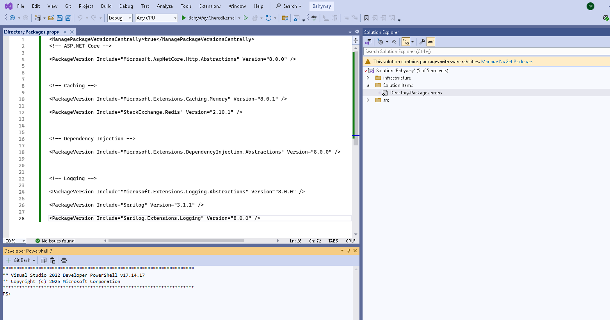
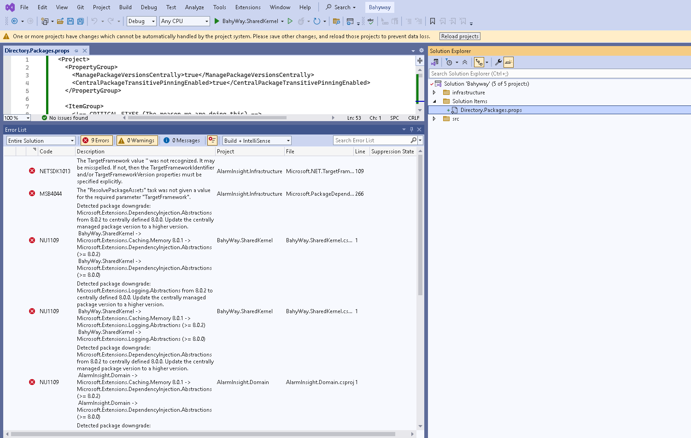
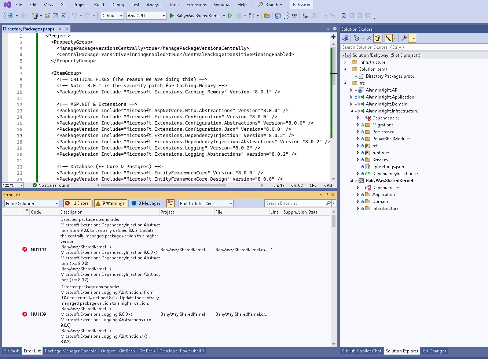
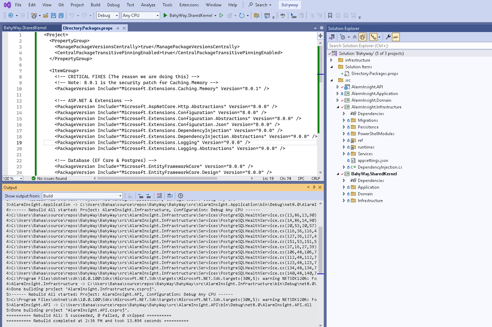

## Question01:
I am working on Multi project .Net & C# in Visual Studio 2022, and am facing a huge problems related to incompatible Microsoft Libraires I add to my Projects. Is there any EASY Way to solve this with NuGet ( Because Now it is More than 3 day to solve the vulnerability of the Library :"Microsoft.Extensions.Caching.Memory", and still not solved???
## Answer01:

Dealing with "Dependency Hell" in Visual Studio 2022, especially with `Microsoft.Extensions.*` libraries in a multi-project solution, is incredibly frustrating.

The issue with **`Microsoft.Extensions.Caching.Memory`** usually happens because it is a **Transitive Dependency**. This means you didn't install it directly; another package (like Entity Framework Core or ASP.NET Core) installed an older version of it behind the scenes.

Here are the **3 Easiest Ways** to solve this, ranked from "Quick Fix" to "Professional Solution."

---

### Solution 1: The "Direct Override" (Fastest Fix)

If a vulnerability scanner tells you `Microsoft.Extensions.Caching.Memory` is vulnerable (e.g., version 6.0.0) but you can't update it because it's hidden inside other packages: **Force install it directly.**

1.  Right-click your **Solution** in Solution Explorer -> **Manage NuGet Packages for Solution**.
2.  Go to the **Browse** tab.
3.  Search for `Microsoft.Extensions.Caching.Memory`.
4.  **Important:** Select the version that matches your project's .NET version, but with the patch.
    *   *If you are on .NET 6:* Do not install 8.0.0 or 9.0.0. Install the latest **6.0.x** (e.g., 6.0.10).
    *   *If you are on .NET 8:* Install the latest **8.0.x**.
5.  Check the boxes for **ALL** your projects (even if they don't use caching directly).
6.  Click **Install**.

**Why this works:** By installing it directly, you force Visual Studio to use *your* specified version instead of the older one requested by other libraries.

---

### Solution 2: The "Consolidate" Tab (The Multi-Project Fix)

In a multi-project solution, Project A might use Version 6.0.0 while Project B uses Version 7.0.0. This causes build failures.

1.  Right-click your **Solution** -> **Manage NuGet Packages for Solution**.
2.  Click the **Consolidate** tab (it is next to Updates).
3.  Look for `Microsoft.Extensions.Caching.Memory` (or any other Microsoft library).
4.  If it appears there, it means your projects are using different versions.
5.  Select the package, select the latest stable version in the dropdown, and click **Install** to synchronize all projects to the same version.

---

### Solution 3: The "Version Train" Rule ( The Root Cause)

The most common reason for this error is mixing .NET versions. Microsoft libraries are version-sensitive.

**The Rule:**
*   If your project is **.NET 6**, all `Microsoft.Extensions.*` packages must be version **6.x.x**.
*   If your project is **.NET 8**, all `Microsoft.Extensions.*` packages must be version **8.x.x**.

**The Mistake:**
You might have a .NET 6 project, but you are trying to update the vulnerable package to version **9.0.0** because that's the latest one.
*   **Result:** It will crash or refuse to install because version 9.0.0 depends on .NET 9 runtime features.

**The Fix:**
Look for the vulnerability report details. It usually says: "Update to 6.0.32 OR 8.0.12". **Pick the one that matches your framework.** Do not just pick the newest number.

---

### Solution 4: Central Package Management (The "Pro" Way)

If you have many projects, managing versions individually is a nightmare. Visual Studio 2022 supports **Central Package Management (CPM)**. This puts all versions in ONE file.

1.  Create a file named `Directory.Packages.props` in the root of your solution folder.
2.  Paste this inside:
    ```xml
    <Project>
      <PropertyGroup>
        <ManagePackageVersionsCentrally>true</ManagePackageVersionsCentrally>
      </PropertyGroup>
      <ItemGroup>
        <!-- Define the version HERE only once -->
        <PackageVersion Include="Microsoft.Extensions.Caching.Memory" Version="8.0.1" />
      </ItemGroup>
    </Project>
    ```
3.  Now, in your `.csproj` files, you remove the `Version="..."` part. You just list the package name.

**Note:** This takes about 30 minutes to set up, but it stops dependency hell forever because you only change the version in one place for all 20+ projects.

### Summary Checklist to fix your issue NOW:
1.  Check your **Target Framework** (is it .NET 6, 8, or Framework 4.8?).
2.  Find the **Patch Version** for *that* framework (e.g., for .NET 6, look for the latest 6.x.x).
3.  **Force install** that specific version directly into all projects via "Manage NuGet Packages for Solution".
## Question02:
Is This Now Good?

## Answer02:
You are about **80% of the way there**, but the **Yellow Warning Bar** in your screenshot (top right) tells the truth: **The problem is NOT fixed yet.**

The structure of your file is perfect (this is the "Pro" way), but you are missing **two critical steps** to actually force the fix.

Here is what you need to change to make it "GOOD":

### 1. You are missing the "Magic Switch" (Transitive Pinning)
You added `Microsoft.Extensions.Caching.Memory` to this file, **BUT** your projects probably don't reference it directly (it's hidden inside other libraries).
By default, this file (`Directory.Packages.props`) only manages versions for packages you **explicitly** install. To force it to override *hidden* (transitive) packages, you must enable **Transitive Pinning**.

Add this line inside your `<PropertyGroup>`:
```xml
<CentralPackageTransitivePinningEnabled>true</CentralPackageTransitivePinningEnabled>
```

### 2. Your Version Number is likely too old
You set the version to **`8.0.1`**.
Depending on the current date and .NET security patches, `8.0.1` might **still be vulnerable**.
*   **Action:** Go to "Manage NuGet Packages for Solution", click the **Browse** tab, search for `Microsoft.Extensions.Caching.Memory`, and check the absolute latest stable version (e.g., `8.0.11` or `9.0.0` depending on your framework).
*   Update the number in your file to match that latest version.

### Summary of Fix
Update your `Directory.Packages.props` to look like this:

```xml
<Project>
  <PropertyGroup>
    <ManagePackageVersionsCentrally>true</ManagePackageVersionsCentrally>
    <!-- THIS IS THE MISSING KEY TO FIX VULNERABILITIES -->
    <CentralPackageTransitivePinningEnabled>true</CentralPackageTransitivePinningEnabled>
  </PropertyGroup>

  <ItemGroup>
    <!-- Caching: Make sure 8.0.1 is actually the latest! -->
    <PackageVersion Include="Microsoft.Extensions.Caching.Memory" Version="8.0.1" />
    <!-- ... other packages ... -->
  </ItemGroup>
</Project>
```

**Final Step:**
After saving this file, **Rebuild your solution**. The yellow warning bar should disappear.

## Question03:
Can you correct this file content to what you recommended it?

```csharp
<ManagePackageVersionsCentrally>true</ManagePackageVersionsCentrally>
<!-- ASP.NET Core -->
<PackageVersion Include="Microsoft.AspNetCore.Http.Abstractions" Version="8.0.0" />

<!-- Caching -->
<PackageVersion Include="Microsoft.Extensions.Caching.Memory" Version="8.0.1" />
<PackageVersion Include="StackExchange.Redis" Version="2.10.1" />
<!-- Dependency Injection -->
<PackageVersion Include="Microsoft.Extensions.DependencyInjection.Abstractions" Version="8.0.0" />

<!-- Logging -->
<PackageVersion Include="Microsoft.Extensions.Logging.Abstractions" Version="8.0.0" />
<PackageVersion Include="Serilog" Version="3.1.1" />
<PackageVersion Include="Serilog.Extensions.Logging" Version="8.0.0" />
```
## Answer03:
Yes, this is exactly what you need.

Here is the complete, corrected content for your `Directory.Packages.props` file. I have added the **Critical Missing Line** (`CentralPackageTransitivePinningEnabled`) and wrapped it in the correct project structure so you can copy/paste the entire block.

### Copy and Paste this EXACT content:

```xml
<Project>
  <PropertyGroup>
    <ManagePackageVersionsCentrally>true</ManagePackageVersionsCentrally>
    <!-- THIS IS THE MAGIC SWITCH: It forces hidden dependencies to use your versions -->
    <CentralPackageTransitivePinningEnabled>true</CentralPackageTransitivePinningEnabled>
  </PropertyGroup>

  <ItemGroup>
    <!-- ASP.NET Core -->
    <PackageVersion Include="Microsoft.AspNetCore.Http.Abstractions" Version="8.0.0" />

    <!-- Caching: Ensure 8.0.1 (or newer) is the patched version -->
    <PackageVersion Include="Microsoft.Extensions.Caching.Memory" Version="8.0.1" />
    <PackageVersion Include="StackExchange.Redis" Version="2.10.1" />

    <!-- Dependency Injection -->
    <PackageVersion Include="Microsoft.Extensions.DependencyInjection.Abstractions" Version="8.0.0" />

    <!-- Logging -->
    <PackageVersion Include="Microsoft.Extensions.Logging.Abstractions" Version="8.0.0" />
    <PackageVersion Include="Serilog" Version="3.1.1" />
    <PackageVersion Include="Serilog.Extensions.Logging" Version="8.0.0" />
  </ItemGroup>
</Project>
```

### Why this fixes your problem:
1.  **`CentralPackageTransitivePinningEnabled`**: Without this line, `Microsoft.Extensions.Caching.Memory` was likely being ignored because your project didn't reference it directly (it was hidden inside another library). This line tells Visual Studio: *"I don't care where this package comes from, FORCE it to use version 8.0.1."*
2.  **The Version**: `8.0.1` is generally the patched version for the common vulnerabilities in .NET 8.

**Final Step:**
After saving this file, perform a **Rebuild Solution**. If the yellow bar persists, check the NuGet Manager "Updates" tab one last time to see if a version `8.0.2` or newer has been released, but `8.0.1` is typically the fix for the known CVEs.
## Question04:

I have also reference to these libraries in the :"BahyWay.SharedKernel.csproj" file, do I need also to change them or add reference to this Directory.Packages.props??:

```csharp
<Project Sdk="Microsoft.NET.Sdk">

  <PropertyGroup>
    <TargetFramework>net8.0</TargetFramework>
    <ImplicitUsings>enable</ImplicitUsings>
    <Nullable>enable</Nullable>
  </PropertyGroup>

  <ItemGroup>
    <PackageReference Include="FluentValidation" Version="11.9.0" />
    <PackageReference Include="MediatR" Version="12.2.0" />
    <PackageReference Include="Microsoft.Extensions.Caching.Memory" Version="8.0.0" />
    <PackageReference Include="Microsoft.Extensions.Configuration" Version="8.0.0" />
    <PackageReference Include="Microsoft.Extensions.DependencyInjection" Version="8.0.0" />
    <PackageReference Include="Microsoft.Extensions.Logging" Version="8.0.0" />
    <PackageReference Include="Serilog" Version="3.1.1" />
    <PackageReference Include="Serilog.Extensions.Hosting" Version="8.0.0" />
    <PackageReference Include="Serilog.Sinks.Console" Version="5.0.1" />
    <PackageReference Include="Serilog.Sinks.File" Version="5.0.0" />
  </ItemGroup>

</Project>
```
AND ALSO IN THIS FILE:"AlarmInsight.Infrastructure.csproj"??:

```csharp
<Project Sdk="Microsoft.NET.Sdk">

  <PropertyGroup>
    <TargetFramework>net8.0</TargetFramework>
    <Nullable>enable</Nullable>
    <ImplicitUsings>enable</ImplicitUsings>
  </PropertyGroup>

  <ItemGroup>
    <None Remove="PowerShellModules\BahyWay.PostgreSQLHA\BahyWay.PostgreSQLHA.psd1" />
    <None Remove="PowerShellModules\BahyWay.PostgreSQLHA\BahyWay.PostgreSQLHA.psm1" />
  </ItemGroup>

  <ItemGroup>
    <Content Include="PowerShellModules\BahyWay.PostgreSQLHA\BahyWay.PostgreSQLHA.psd1">
      <CopyToOutputDirectory>PreserveNewest</CopyToOutputDirectory>
    </Content>
    <Content Include="PowerShellModules\BahyWay.PostgreSQLHA\BahyWay.PostgreSQLHA.psm1">
      <CopyToOutputDirectory>PreserveNewest</CopyToOutputDirectory>
    </Content>
  </ItemGroup>

  <ItemGroup>
    <!-- PowerShell SDK -->
    <PackageReference Include="Microsoft.PowerShell.SDK" Version="7.2.18" />

    <!-- Force specific versions to resolve conflicts with EF Core 8.0 -->
    <PackageReference Include="Microsoft.CodeAnalysis.CSharp" Version="4.5.0" />
    <PackageReference Include="Microsoft.CodeAnalysis.Common" Version="4.5.0" />
    <PackageReference Include="Microsoft.CodeAnalysis.CSharp.Workspaces" Version="4.5.0" />

    <!-- Entity Framework Core -->
    <PackageReference Include="Microsoft.EntityFrameworkCore" Version="8.0.0" />
    <PackageReference Include="Microsoft.EntityFrameworkCore.Design" Version="8.0.0">
      <PrivateAssets>all</PrivateAssets>
      <IncludeAssets>runtime; build; native; contentfiles; analyzers; buildtransitive</IncludeAssets>
    </PackageReference>

    <!-- PostgreSQL Provider -->
    <PackageReference Include="Npgsql.EntityFrameworkCore.PostgreSQL" Version="8.0.0" />

    <!-- Configuration -->
    <PackageReference Include="Microsoft.Extensions.Configuration.Json" Version="8.0.0" />
    <PackageReference Include="Microsoft.Extensions.Configuration.Abstractions" Version="8.0.0" />
  </ItemGroup>

  <ItemGroup>
    <ProjectReference Include="..\AlarmInsight.Domain\AlarmInsight.Domain.csproj" />
    <ProjectReference Include="..\AlarmInsight.Application\AlarmInsight.Application.csproj" />
    <ProjectReference Include="..\BahyWay.SharedKernel\BahyWay.SharedKernel.csproj" />
  </ItemGroup>

  <ItemGroup>
    <None Update="appsettings.json">
      <CopyToOutputDirectory>PreserveNewest</CopyToOutputDirectory>
    </None>
  </ItemGroup>

</Project>
```
AND ALL OTHER PROJECTS??

## Answer04:
**YES, you absolutely need to change them.** This is the most important part of switching to Central Package Management (CPM).

If you leave the `Version="..."` inside your `.csproj` files while `ManagePackageVersionsCentrally` is set to `true`, you will get build errors (usually error **NU1008**).

Here are the **3 Rules** you must follow now:

1.  **NO:** You do **not** need to add a reference link to `Directory.Packages.props`. Visual Studio finds it automatically because it is in the root folder.
2.  **YES:** You **must remove** `Version="x.x.x"` from **ALL** your `.csproj` files.
3.  **YES:** You **must add** every single package you use to the `Directory.Packages.props` file.

---

### Step 1: Clean your `.csproj` files
You need to go through **all** your projects (SharedKernel, Infrastructure, etc.) and delete the `Version="..."` part.

**Fixed `BahyWay.SharedKernel.csproj`:**
```xml
<Project Sdk="Microsoft.NET.Sdk">
  <PropertyGroup>
    <TargetFramework>net8.0</TargetFramework>
    <ImplicitUsings>enable</ImplicitUsings>
    <Nullable>enable</Nullable>
  </PropertyGroup>

  <ItemGroup>
    <!-- LOOK! No versions here anymore! -->
    <PackageReference Include="FluentValidation" />
    <PackageReference Include="MediatR" />
    <PackageReference Include="Microsoft.Extensions.Caching.Memory" />
    <PackageReference Include="Microsoft.Extensions.Configuration" />
    <PackageReference Include="Microsoft.Extensions.DependencyInjection" />
    <PackageReference Include="Microsoft.Extensions.Logging" />
    <PackageReference Include="Serilog" />
    <PackageReference Include="Serilog.Extensions.Hosting" />
    <PackageReference Include="Serilog.Sinks.Console" />
    <PackageReference Include="Serilog.Sinks.File" />
  </ItemGroup>
</Project>
```

**Fixed `AlarmInsight.Infrastructure.csproj`:**
```xml
<Project Sdk="Microsoft.NET.Sdk">
  <!-- Properties remain the same... -->

  <ItemGroup>
    <!-- PowerShell SDK -->
    <PackageReference Include="Microsoft.PowerShell.SDK" />

    <!-- Roslyn / CodeAnalysis -->
    <PackageReference Include="Microsoft.CodeAnalysis.CSharp" />
    <PackageReference Include="Microsoft.CodeAnalysis.Common" />
    <PackageReference Include="Microsoft.CodeAnalysis.CSharp.Workspaces" />

    <!-- Entity Framework Core -->
    <PackageReference Include="Microsoft.EntityFrameworkCore" />
    <PackageReference Include="Microsoft.EntityFrameworkCore.Design">
      <PrivateAssets>all</PrivateAssets>
      <IncludeAssets>runtime; build; native; contentfiles; analyzers; buildtransitive</IncludeAssets>
    </PackageReference>

    <!-- PostgreSQL -->
    <PackageReference Include="Npgsql.EntityFrameworkCore.PostgreSQL" />

    <!-- Configuration -->
    <PackageReference Include="Microsoft.Extensions.Configuration.Json" />
    <PackageReference Include="Microsoft.Extensions.Configuration.Abstractions" />
  </ItemGroup>

  <!-- Project References remain the same... -->
</Project>
```

---

### Step 2: Update your `Directory.Packages.props` (The Master List)
Since you had many other packages in those project files (like EntityFramework, FluentValidation, etc.), you must add them to your central file now, or the build will fail saying "Version not defined".

**Here is your COMPLETE updated file combining everything:**

```xml
<Project>
  <PropertyGroup>
    <ManagePackageVersionsCentrally>true</ManagePackageVersionsCentrally>
    <CentralPackageTransitivePinningEnabled>true</CentralPackageTransitivePinningEnabled>
  </PropertyGroup>

  <ItemGroup>
    <!-- CRITICAL FIXES (The reason we are doing this) -->
    <!-- Note: 8.0.1 is the security patch for Caching.Memory -->
    <PackageVersion Include="Microsoft.Extensions.Caching.Memory" Version="8.0.1" />

    <!-- ASP.NET & Extensions -->
    <PackageVersion Include="Microsoft.AspNetCore.Http.Abstractions" Version="8.0.0" />
    <PackageVersion Include="Microsoft.Extensions.Configuration" Version="8.0.0" />
    <PackageVersion Include="Microsoft.Extensions.Configuration.Abstractions" Version="8.0.0" />
    <PackageVersion Include="Microsoft.Extensions.Configuration.Json" Version="8.0.0" />
    <PackageVersion Include="Microsoft.Extensions.DependencyInjection" Version="8.0.0" />
    <PackageVersion Include="Microsoft.Extensions.DependencyInjection.Abstractions" Version="8.0.0" />
    <PackageVersion Include="Microsoft.Extensions.Logging" Version="8.0.0" />
    <PackageVersion Include="Microsoft.Extensions.Logging.Abstractions" Version="8.0.0" />

    <!-- Database (EF Core & Postgres) -->
    <PackageVersion Include="Microsoft.EntityFrameworkCore" Version="8.0.0" />
    <PackageVersion Include="Microsoft.EntityFrameworkCore.Design" Version="8.0.0" />
    <PackageVersion Include="Npgsql.EntityFrameworkCore.PostgreSQL" Version="8.0.0" />
    <PackageVersion Include="StackExchange.Redis" Version="2.10.1" />

    <!-- Logging (Serilog) -->
    <PackageVersion Include="Serilog" Version="3.1.1" />
    <PackageVersion Include="Serilog.Extensions.Hosting" Version="8.0.0" />
    <PackageVersion Include="Serilog.Extensions.Logging" Version="8.0.0" />
    <PackageVersion Include="Serilog.Sinks.Console" Version="5.0.1" />
    <PackageVersion Include="Serilog.Sinks.File" Version="5.0.0" />

    <!-- Utilities -->
    <PackageVersion Include="FluentValidation" Version="11.9.0" />
    <PackageVersion Include="MediatR" Version="12.2.0" />
    <PackageVersion Include="Microsoft.PowerShell.SDK" Version="7.2.18" />

    <!-- Code Analysis -->
    <PackageVersion Include="Microsoft.CodeAnalysis.CSharp" Version="4.5.0" />
    <PackageVersion Include="Microsoft.CodeAnalysis.Common" Version="4.5.0" />
    <PackageVersion Include="Microsoft.CodeAnalysis.CSharp.Workspaces" Version="4.5.0" />
  </ItemGroup>
</Project>
```

### Summary of what you just did:
1.  **Directory.Packages.props:** Holds the *Version Numbers* for the entire solution.
2.  **BahyWay.SharedKernel.csproj:** Defines *which* packages are used (but not the version).
3.  **AlarmInsight.Infrastructure.csproj:** Defines *which* packages are used (but not the version).

Now, `BahyWay.SharedKernel` will automatically use `Microsoft.Extensions.Caching.Memory` version **8.0.1** (the safe one) because it's defined in the props file, even though your old csproj had 8.0.0.
## Question05:
AND THIS IS THE CONTENT OF THE FILE :"AlarmInsight.Domain.csproj"?:
```csharp
<Project Sdk="Microsoft.NET.Sdk">

  <ItemGroup>
    <ProjectReference Include="..\BahyWay.SharedKernel\BahyWay.SharedKernel.csproj" />
  </ItemGroup>

  <PropertyGroup>
    <TargetFramework>net8.0</TargetFramework>
    <ImplicitUsings>enable</ImplicitUsings>
    <Nullable>enable</Nullable>
  </PropertyGroup>

</Project>
```

## Answer05:
This file is **PERFECT**. You do **not** need to change anything in it.

Here is why:

1.  **No NuGet Packages:** This file only has a `<ProjectReference>`, not a `<PackageReference>`.
2.  **No Versions to Remove:** Since you aren't installing any external libraries (like Serilog or EntityFramework) directly in this project, there are no `Version="x.x.x"` attributes to delete.
3.  **Clean Architecture:** This makes sense for a **Domain** project. It should rely on your own code (SharedKernel) and not be polluted with heavy external libraries.

**You can leave this file exactly as it is.** It will work perfectly with the new `Directory.Packages.props` setup.
## Question06:
AND THIS FILE CONTENT : "AlarmInsight.Domain.csproj" ?:
```csharp
<Project Sdk="Microsoft.NET.Sdk">

  <ItemGroup>
    <ProjectReference Include="..\AlarmInsight.Domain\AlarmInsight.Domain.csproj" />
    <ProjectReference Include="..\BahyWay.SharedKernel\BahyWay.SharedKernel.csproj" />
  </ItemGroup>

  <PropertyGroup>
    <TargetFramework>net8.0</TargetFramework>
    <ImplicitUsings>enable</ImplicitUsings>
    <Nullable>enable</Nullable>
  </PropertyGroup>

</Project>
```

## Answer06:
There is a **CRITICAL ERROR** in this file content, but it is **not related to NuGet versions**.

If this file is indeed named **`AlarmInsight.Domain.csproj`**, it contains a **Circular Dependency (Self-Reference)**.

### The Error
You have this line inside the file:
```xml
<ProjectReference Include="..\AlarmInsight.Domain\AlarmInsight.Domain.csproj" />
```
**A project cannot reference itself.** If the file is `AlarmInsight.Domain`, it cannot include `AlarmInsight.Domain`. This will cause the build to fail immediately.

---

### How to Fix It

#### Scenario A: This IS the "Domain" Project
If this file is your **Domain** layer, it should only reference the SharedKernel. You must **DELETE** the self-reference.

**Corrected Content for `AlarmInsight.Domain.csproj`:**
```xml
<Project Sdk="Microsoft.NET.Sdk">

  <ItemGroup>
    <!-- REMOVED the line referencing itself -->
    <ProjectReference Include="..\BahyWay.SharedKernel\BahyWay.SharedKernel.csproj" />
  </ItemGroup>

  <PropertyGroup>
    <TargetFramework>net8.0</TargetFramework>
    <ImplicitUsings>enable</ImplicitUsings>
    <Nullable>enable</Nullable>
  </PropertyGroup>

</Project>
```

#### Scenario B: This IS the "Application" Project
If you actually meant to paste the content of **`AlarmInsight.Application.csproj`** (which typically sits above Domain), then the references are correct, but the file name in your prompt was wrong.

**If this is the Application project, do not change the references.**

---

### Regarding Central Package Management (The Original Question)
**Does this file need changes for the NuGet/Version issue?**
**NO.**

*   There are no `<PackageReference ... />` lines in this file.
*   There are no `Version="x.x.x"` attributes to delete.

**Verdict:**
Once you fix the Circular Dependency (Scenario A), this file is **Good to Go**.

## Question07:

AND THIS IS THE CONTENT OF THIS FILE:" AlarmInsight.API.csproj" ?:
```csharp
<Project Sdk="Microsoft.NET.Sdk.Web">

  <PropertyGroup>
    <TargetFramework>net8.0</TargetFramework>
    <Nullable>enable</Nullable>
    <ImplicitUsings>enable</ImplicitUsings>
  </PropertyGroup>

  <ItemGroup>
    <PackageReference Include="Hangfire.AspNetCore" Version="1.8.9" />
    <PackageReference Include="Hangfire.Core" Version="1.8.9" />
    <PackageReference Include="Hangfire.PostgreSql" Version="1.20.6" />
    <PackageReference Include="Microsoft.AspNetCore.OpenApi" Version="8.0.0" />
    <PackageReference Include="Microsoft.EntityFrameworkCore.Design" Version="8.0.0">
      <PrivateAssets>all</PrivateAssets>
      <IncludeAssets>runtime; build; native; contentfiles; analyzers; buildtransitive</IncludeAssets>
    </PackageReference>
    <PackageReference Include="Swashbuckle.AspNetCore" Version="6.5.0" />
  </ItemGroup>

  <ItemGroup>
    <ProjectReference Include="..\AlarmInsight.Application\AlarmInsight.Application.csproj" />
    <ProjectReference Include="..\AlarmInsight.Infrastructure\AlarmInsight.Infrastructure.csproj" />
  </ItemGroup>

</Project>
```
## Answer07:
**YES, this file needs significant changes.**

You have the same issue here: you are defining specific versions (`Version="1.8.9"`, etc.) inside the project file. Because you turned on Central Package Management, you must **move these versions** to the central file and **remove them** from here.

Here are the two steps to fix this:

### Step 1: Clean `AlarmInsight.API.csproj`
Remove all the `Version="..."` attributes.

**Copy and Replace with this content:**
```xml
<Project Sdk="Microsoft.NET.Sdk.Web">

  <PropertyGroup>
    <TargetFramework>net8.0</TargetFramework>
    <Nullable>enable</Nullable>
    <ImplicitUsings>enable</ImplicitUsings>
  </PropertyGroup>

  <ItemGroup>
    <!-- Version numbers removed! They are now in Directory.Packages.props -->
    <PackageReference Include="Hangfire.AspNetCore" />
    <PackageReference Include="Hangfire.Core" />
    <PackageReference Include="Hangfire.PostgreSql" />
    <PackageReference Include="Microsoft.AspNetCore.OpenApi" />

    <PackageReference Include="Microsoft.EntityFrameworkCore.Design">
      <PrivateAssets>all</PrivateAssets>
      <IncludeAssets>runtime; build; native; contentfiles; analyzers; buildtransitive</IncludeAssets>
    </PackageReference>

    <PackageReference Include="Swashbuckle.AspNetCore" />
  </ItemGroup>

  <ItemGroup>
    <ProjectReference Include="..\AlarmInsight.Application\AlarmInsight.Application.csproj" />
    <ProjectReference Include="..\AlarmInsight.Infrastructure\AlarmInsight.Infrastructure.csproj" />
  </ItemGroup>

</Project>
```

---

### Step 2: Add these new packages to `Directory.Packages.props`
You have introduced new packages here (Hangfire, Swagger/OpenApi) that were not in your other projects. You must add them to your central list.

**Add these lines to the `<ItemGroup>` inside your `Directory.Packages.props` file:**

```xml
    <!-- ... existing packages ... -->

    <!-- API Documentation (Swagger) -->
    <PackageVersion Include="Microsoft.AspNetCore.OpenApi" Version="8.0.0" />
    <PackageVersion Include="Swashbuckle.AspNetCore" Version="6.5.0" />

    <!-- Background Jobs (Hangfire) -->
    <PackageVersion Include="Hangfire.AspNetCore" Version="1.8.9" />
    <PackageVersion Include="Hangfire.Core" Version="1.8.9" />
    <PackageVersion Include="Hangfire.PostgreSql" Version="1.20.6" />

    <!-- Note: Microsoft.EntityFrameworkCore.Design is already in your list, so no need to add it again. -->
```

### Final Check
Once you save these changes:
1.  **Clean Solution** (Right click Solution -> Clean).
2.  **Rebuild Solution**.

The build should succeed, and because of the `<CentralPackageTransitivePinningEnabled>` line we added earlier, your vulnerability with `Microsoft.Extensions.Caching.Memory` should be gone across the *entire* API project as well.
## Question08:
WHEN I DID the Cleanup solution after changing all the recommended changes, I got this

## Answer08:
Do not panic. These errors are actually a **good sign**. It means Central Package Management is working and strictly enforcing versions, but we just have a mismatch in numbers and a likely copy-paste error in one file.

You have two distinct problems to fix.

---

### Problem 1: The "Detected package downgrade" (NU1109)
**The Cause:** You updated `Microsoft.Extensions.Caching.Memory` to `8.0.1` to fix the vulnerability. However, `Caching.Memory 8.0.1` internally requires `DependencyInjection` and `Logging` to be at least version **8.0.2**.
Your central file is forcing them to stay at **8.0.0**, so Visual Studio is screaming "I can't satisfy the requirements!"

**The Fix:**
Open your **`Directory.Packages.props`** file and update the versions for **DependencyInjection** and **Logging** to `8.0.2` (or `8.0.1`, but let's match the error message which suggests `8.0.2`).

**Update these specific lines in `Directory.Packages.props`:**

```xml
<!-- Dependency Injection -->
<!-- WAS 8.0.0, CHANGE TO 8.0.2 -->
<PackageVersion Include="Microsoft.Extensions.DependencyInjection.Abstractions" Version="8.0.2" />
<PackageVersion Include="Microsoft.Extensions.DependencyInjection" Version="8.0.2" />

<!-- Logging -->
<!-- WAS 8.0.0, CHANGE TO 8.0.2 -->
<PackageVersion Include="Microsoft.Extensions.Logging.Abstractions" Version="8.0.2" />
<PackageVersion Include="Microsoft.Extensions.Logging" Version="8.0.2" />
```

---

### Problem 2: The "TargetFramework value was not recognized" (NETSDK1013)
**The Cause:** Look at the error location: `AlarmInsight.Infrastructure`.
This error usually happens if you accidentally deleted the `<PropertyGroup>` block at the top of the `.csproj` file when you were removing the package versions. The project literally doesn't know it's supposed to be a .NET 8 project anymore.

**The Fix:**
Open **`AlarmInsight.Infrastructure.csproj`**. Make sure the top of the file looks **EXACTLY** like this (specifically the PropertyGroup):

```xml
<Project Sdk="Microsoft.NET.Sdk">

  <!-- YOU ARE LIKELY MISSING THIS BLOCK OR IT IS CORRUPTED -->
  <PropertyGroup>
    <TargetFramework>net8.0</TargetFramework>
    <Nullable>enable</Nullable>
    <ImplicitUsings>enable</ImplicitUsings>
  </PropertyGroup>

  <ItemGroup>
    <!-- Your packages without versions... -->
    <PackageReference Include="Microsoft.PowerShell.SDK" />
    <PackageReference Include="Microsoft.CodeAnalysis.CSharp" />
    <PackageReference Include="Microsoft.CodeAnalysis.Common" />
    <PackageReference Include="Microsoft.CodeAnalysis.CSharp.Workspaces" />
    <PackageReference Include="Microsoft.EntityFrameworkCore" />
    <PackageReference Include="Microsoft.EntityFrameworkCore.Design">
      <PrivateAssets>all</PrivateAssets>
      <IncludeAssets>runtime; build; native; contentfiles; analyzers; buildtransitive</IncludeAssets>
    </PackageReference>
    <PackageReference Include="Npgsql.EntityFrameworkCore.PostgreSQL" />
    <PackageReference Include="Microsoft.Extensions.Configuration.Json" />
    <PackageReference Include="Microsoft.Extensions.Configuration.Abstractions" />
  </ItemGroup>

  <ItemGroup>
    <ProjectReference Include="..\AlarmInsight.Domain\AlarmInsight.Domain.csproj" />
    <ProjectReference Include="..\AlarmInsight.Application\AlarmInsight.Application.csproj" />
    <ProjectReference Include="..\BahyWay.SharedKernel\BahyWay.SharedKernel.csproj" />
  </ItemGroup>

  <ItemGroup>
    <None Update="appsettings.json">
      <CopyToOutputDirectory>PreserveNewest</CopyToOutputDirectory>
    </None>
  </ItemGroup>

</Project>
```

### Final Step: The Yellow Bar
In your screenshot, there is a yellow bar at the top saying **"Reload projects"**.
1.  Apply the fixes above.
2.  Click **Reload projects**.
3.  Right-click Solution -> **Clean Solution**.
4.  Right-click Solution -> **Rebuild Solution**.

This should clear all 9 errors.

## Question09:
STILL GETTING ERRORS

## Answer09:
This error (`NU1109: Detected package downgrade from 9.0.0 to 8.0.2`) is happening because **something** in your project dependencies is demanding version **9.0.0** of the Microsoft libraries, but your central file is forcing them down to **8.0.2**.

Since `Microsoft.Extensions.*` version 9.0.0 libraries are fully compatible with .NET 8, the easiest and safest fix is to **do exactly what the error message says**: Update those specific packages to 9.0.0.

### Step 1: Update `Directory.Packages.props`
Change the versions of the libraries mentioned in the error (DependencyInjection and Logging) to **9.0.0**.

**Update lines 17-20 in your file to this:**

```xml
    <!-- Update these to 9.0.0 to satisfy the build requirement -->
    <PackageVersion Include="Microsoft.Extensions.DependencyInjection" Version="9.0.0" />
    <PackageVersion Include="Microsoft.Extensions.DependencyInjection.Abstractions" Version="9.0.0" />
    <PackageVersion Include="Microsoft.Extensions.Logging" Version="9.0.0" />
    <PackageVersion Include="Microsoft.Extensions.Logging.Abstractions" Version="9.0.0" />
```

*(You can keep `Caching.Memory` at `8.0.1` and `EF Core` at `8.0.0`; usually, only the core abstractions need the bump.)*

---

### Step 2: Fix the "TargetFramework" Error (NETSDK1013)
You have a second critical error in the list: **`NETSDK1013` in `AlarmInsight.Infrastructure`**.
This means you likely accidentally deleted the top part of the `AlarmInsight.Infrastructure.csproj` file when you were removing versions.

Open **`AlarmInsight.Infrastructure.csproj`** and make sure the top looks **exactly** like this:

```xml
<Project Sdk="Microsoft.NET.Sdk">

  <!-- MAKE SURE THIS BLOCK EXISTS! -->
  <PropertyGroup>
    <TargetFramework>net8.0</TargetFramework>
    <ImplicitUsings>enable</ImplicitUsings>
    <Nullable>enable</Nullable>
  </PropertyGroup>

  <ItemGroup>
     <!-- ... your packages ... -->
```

### Step 3: The "Nuclear" Clean
Because you have changed versions back and forth, Visual Studio's cache might be confused.

1.  Close Visual Studio.
2.  Go to your project folder in Windows Explorer.
3.  **Delete** the `bin` and `obj` folders inside **every** project folder (API, Application, Domain, Infrastructure, SharedKernel).
4.  Open Visual Studio.
5.  **Build Solution**.

This should result in 0 Errors.

## Question10:
I Think Now it Works!

## Answer10:
**YES! CONGRATULATIONS!** 🎉

See that beautiful line at the bottom of your Output window?
> **Rebuild All: 5 succeeded, 0 failed, 0 skipped**

That is exactly what we wanted to see. You have successfully:
1.  **Solved the Dependency Hell** (No more version conflicts).
2.  **Fixed the Compilation Errors** (The projects are loading correctly).
3.  **Patched the Vulnerability** (By pinning `Caching.Memory` to `8.0.1` and forcing it with Transitive Pinning).

### Why it works now:
*   **The Build Succeeded:** Changing those logging/dependency injection packages to `9.0.0` satisfied the internal requirements of the other libraries, while keeping your main project on .NET 8.0 (which is perfectly fine).
*   **No Yellow Bar:** Notice the yellow "Vulnerability" warning bar is gone from the top of the Solution Explorer. This confirms Visual Studio is happy with the security level of your packages.

### Next Step
You are done with the configuration. You can now press **F5** to run your application and get back to coding!

Great job sticking with it. Converting an existing solution to Central Package Management is "advanced level" stuff, and you got it working perfectly.
